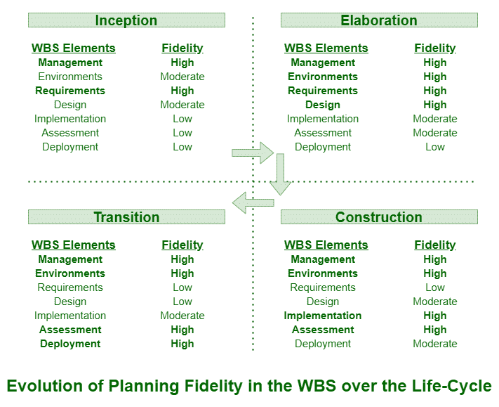

# 软件工程中的规划指南

> 原文:[https://www . geesforgeks . org/planning-guidelines-in-software-engineering/](https://www.geeksforgeeks.org/planning-guidelines-in-software-engineering/)

**规划指南**通常是书面声明，包含在项目进行任何开发和建立之前需要参考的指南。规划指南通常用于统一、舒适和安全开发的目的。任何发展方都应遵循这些规划指南。这些是根据许多其他人的经验制定的初步规划指南。规划指南创造了一个方便的生活环境。因此，这些准则被认为是可信的估计基础，并在利益相关者中建立了一定程度的信心。

项目开发通常应遵循两个规划准则。这些准则如下:

*   为一级工作分解结构的所有要素之间的默认成本分配提供建议。
    下面是给出的表格。在此表中，您将看到一级工作分解结构所有要素的预算成本的默认分配。不同项目的价值可能会有所变化，但分配通常起着重要作用，它通过完全理解和了解偏离这些准则的理由，为评估计划提供了一个良好的基准。这实际上是一种成本分配，而不是努力分配。

<figure class="table">

| 一级工作分解结构元素 | 默认预算 |
| 管理 | 10 % |
| 环境 | 10 % |
| 要求 | 10 % |
| 设计 | 15 % |
| 履行 | 25 % |
| 评价 | 25 % |
| 部署 | 5 % |
| 总数 | 100 % |

</figure>

*   Give Advice for allocation of effort and schedule across all phases of a life-cycle. 
    Below is a table is given. In this table, you will see allocation of effort and schedule. Value might change or vary across various projects, but allocation generally plays an essential role by providing an average expectation across a spectrum of domain of application. 

<figure class="table">

| 领域 | 开始 | 详细阐述 | 建筑 | 过渡 |
| 努力 | 5 % | 20 % | 65 % | 10 % |
| 日程安排 | 10 % | thirty percent | 50 % | 10 % |

</figure>

所有的指导方针都只是将广泛的框架转化为充分解释的发展原则。它们在实现项目的高质量开发中起着重要作用。但是有时候，关于项目独立规划的建议也是有风险的。这些指导方针可以被盲目采用，而不需要对特定项目的环境进行任何调整。另一个风险可能是错误的解释。