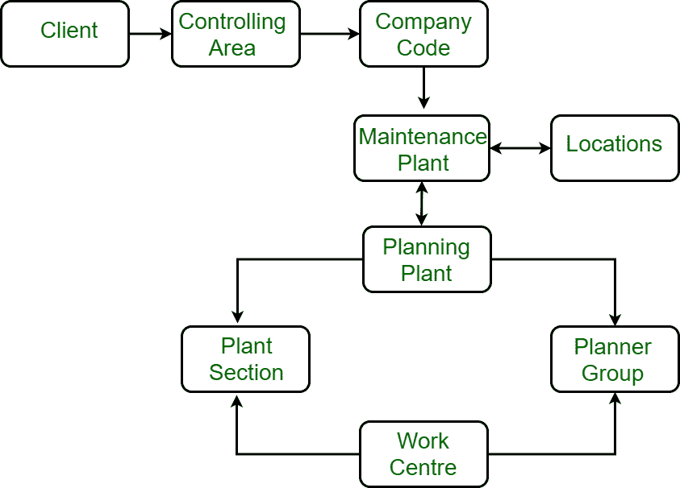

# 工厂维护

> 原文:[https://www.geeksforgeeks.org/plant-maintenance/](https://www.geeksforgeeks.org/plant-maintenance/)

**工厂维护**是一种提供**集成解决方案**的模块，该解决方案支持整个企业系统的运营需求。本模块包括所有产品，涵盖在良好运行条件下维护工厂或设备的所有方面，以避免生产中断和损失。它也成为获取过程改进成果的一部分。

**图:工厂维护的组织结构**

**工厂维护的主要子系统是:**

1.  **预防性维护控制:**
    预防性维护控制使组织能够通过避免停机时间、机器损坏和过程可变性来降低维修成本。它还提供设施的规划、调度和控制。
2.  **设备追踪:**
    一个设备是有用的东西，需要保护和监控。它的成本构成了一个组织最大的支出。

*   **组件跟踪:**
    组件是较大设备的子集，也应获得相同的成本控制支出。它使支出经理能够识别有维修问题的组件。*   **工厂维护校准跟踪:**
    它允许组织充分利用其在工厂维护模块中的投资。*   **Plant maintenance warranty claims tracking :**
    It is an administrative system to provide control of all items covered by manufacturer and vendor warranties. It includes the ability to establish the type and length of warranty.

    **工厂维护目标:**

    *   它有助于最大限度地减少由于任何设备故障造成的生产时间损失。
    *   它有助于质量和产品改进。
    *   它将所有资产保持在适当的工作条件下。

    **工厂维护的优势:**

    *   它有助于减少故障损失。
    *   它有助于减少质量缺陷。
    *   它增加了净质量利润。
    *   它降低了维护成本。

    **工厂维护的缺点:**

    *   它增加了诊断设备的投资。
    *   这也增加了对员工培训的投资。
    *   管理层不容易看到的储蓄潜力。