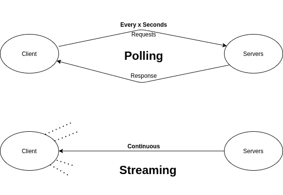

# 轮询和流式传输–概念&场景

> 原文:[https://www . geesforgeks . org/polling-and-streaming-concept-scenarios/](https://www.geeksforgeeks.org/polling-and-streaming-concept-scenarios/)

在系统中，客户机和服务器一起通信，其中客户机请求和服务器用所请求的数据响应各自的客户机。现在*可以选择更新数据需要什么频率？*嗯，这完全取决于你的目的和你的系统。这里我们将讨论两个基本概念**投票和流。**

### 投票

它被定义为客户端以固定的时间间隔(可能每 x 秒)请求一个特定的数据，而服务器以通常的响应回复所需数据的过程。

在这些场景中，客户端需要在即时模式下定期更新数据(从服务器获取数据)，轮询可能对您的架构没有好处。 **Ex:** 您正在构建一个聊天应用程序，在该程序中，您有许多旨在实时相互通信的客户端。作为**系统设计专家**，你需要确保客户端即时得到**更新****(这里的更新是指聊天、txt、消息)。但是**轮询并不适合所有地方**作为 Chatbox 的一个例子，你需要在对方发送的时候获得**即时消息**，但是由于设置了 x 秒的间隔，你无法获得消息的即时感受，你的消息会有很多延迟**

**轮询的最佳适用性是每隔 30 秒/1 分钟定期获取温度更新。**

### ****流****

**流是通过套接字完成的，这里可以详细了解套接字[。](https://www.geeksforgeeks.org/socket-in-computer-network/)通俗地说，插座是一个文件，你的电脑可以通过长宽度连接与另一台电脑进行读写，一个**开放式连接**直到一台机器关机。**

****例:**像 WhatsApp/Instagram 等一样设计聊天应用**

**在这里，您可能会想到选择减少设置的时间间隔，并使用轮询代替流，也就是说，您可能会想到**将设置的时间间隔**减少到 1 秒/0.5 秒，而不是在 10 秒内，您为单个客户端请求多达 20 个请求，对于数百万个客户端，这将为我们的服务器同时处理这些请求带来问题。在这里，您需要注意，您可能会在消息中获得即时体验，但这并不是最佳的，因为这会给服务器带来更多的负载。**

**

轮询视频流** 

****关键点:**在轮询中，对于服务器的响应，每个请求都会被发送，但在流传输中，客户端会公开监听，而不会收到服务器的外部数据请求。在服务器端，对于流式传输，它不会等待每个请求发送数据，而是在注意到任何变化时推送数据。通过流式传输，您可以获得即时聊天体验，而不会有任何延迟，也不会为每个客户端每秒发送 10-20 个请求。**

### **情节**

**当**客户端处理**比慢时，在轮询和流的情况下可能会出现不同的情况。**

****在流**中，更新将在客户端形成一个长队列，一旦接收到第一个事件，服务器将连续发送下一个事件，直到结束，由于处理不佳，将会有**延迟**，但在那里**不会有任何形式的零星数据。****

****在轮询**中，进程需要一些时间来更新。一旦它完成一个，它就会要求另一个并且**立即回答它。**服务器总是试图保持健壮，并保持流连接工作；如果它不能写，它将只是等待，并可能过滤更新。**

****注意:** *流并不比轮询好，轮询可能比流更好，这完全取决于你的用例和系统。***

****一般规则:**如果你需要让你的数据即时更新(实时更新)，那么你想使用流，如果你正在建立一个仪表板，而不是监测股票价格或有这样的用例在这里，你可能更喜欢轮询，因为没有开放连接的真正需要，每 30 秒你可以得到数据更新。**