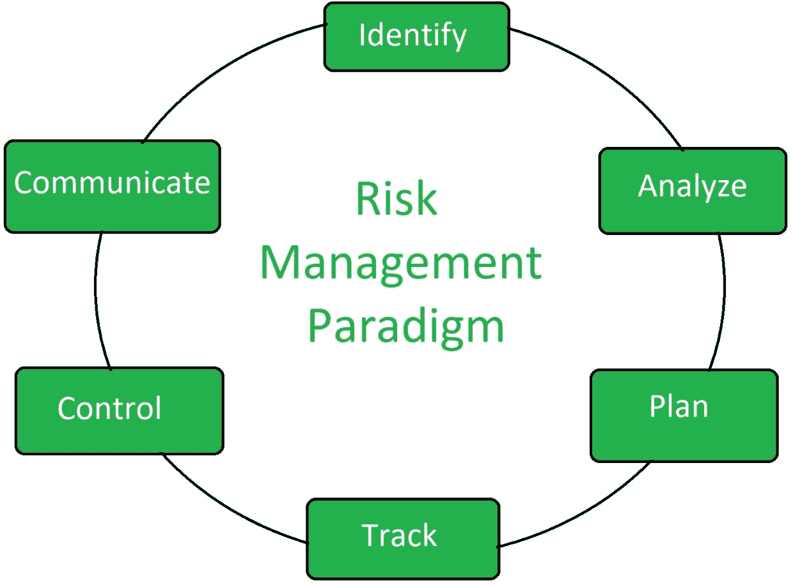

# 风险管理原则和范式

> 原文:[https://www . geeksforgeeks . org/风险管理和范例原则/](https://www.geeksforgeeks.org/principles-of-risk-management-and-paradigm/)

**风险管理**是一种有助于管理和最佳利用可用资源的方法。一个计算机代码项目可能会被降低风险，以便准备好一致地建立可能对计算机代码项目产生影响的必要风险。有必要将风险分成完全不同的类别。然后，项目经理将检查与项目相关的每个类别方块度量的风险。

**风险管理原则:**
风险管理有 5 条原则。它们是:

1.  **全局视角:**
    考虑更大的系统定义、设计和实现。风险将带来的机会和影响已经看到了。在系统和计划解决的业务问题的背景下查看软件风险。
2.  **前瞻观点:**
    着眼于可能被拖累的可能不确定性。考虑未来可能发生的风险的可能解决方案。思考未来可能发生的风险，并为管理未来事件制定未来计划。

*   **开放通信:**
    这使得最终用户和开发团队之间的通信能够自由流动，以便他们能够澄清风险。鼓励所有利益相关者和用户随时提出风险建议。*   **综合管理:**
    在此阶段，风险管理成为项目管理不可或缺的一部分。软件过程中应该考虑风险。*   **Continuous Process:**
    Risks are tracked continuously throughout the risk management paradigm during this phase. Modify the identified risk than the more information is known and add new risks as better insight is achieved.

    **风险管理范式:**

    

    1.  **识别:**
        在产生重大问题之前识别风险。如果在风险造成重大问题之前就确定了风险，那么控制风险就不会有更多的困难。
    2.  **分析:**
        深度分析风险的性质、行为和类型，收集相关信息。这是确定风险知识所必需的。
    3.  **计划:**
        把计划转化为行动和执行。这一阶段包括以前完成的计划的行动和实施。风险检测计划制定并执行后。
    4.  **追踪:**
        监控必要的行动。必要行动是指为消除和最小化检测到的风险所需的工作。
    5.  **控制:**
        纠正偏差，进行必要的更改。将正确的东西放在正确的地方，所需的字段将根据所需的更改而更改。
    6.  **沟通:**
        讨论当前风险和未来风险及其管理。在开发人员和测试人员之间就软件中发现的风险进行富有成效的讨论。