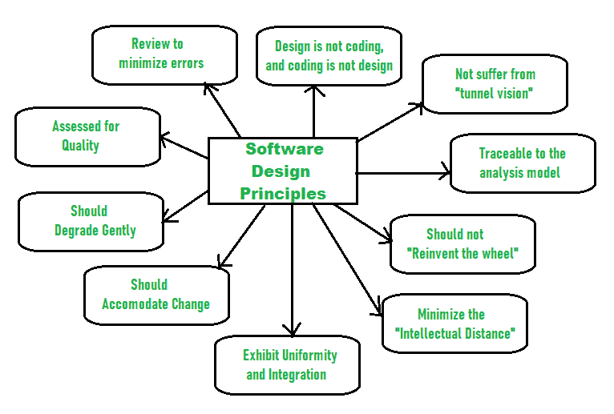

# 软件设计原则

> 原文:[https://www . geesforgeks . org/软件设计原则/](https://www.geeksforgeeks.org/principles-of-software-design/)

先决条件–

*   [软件设计流程](https://www.geeksforgeeks.org/software-engineering-software-design-process/)
*   [软件设计流程|第二集](https://www.geeksforgeeks.org/introduction-of-software-design-process-set-2/)
*   [软件开发的现代原理](https://www.geeksforgeeks.org/modern-principles-of-software-development/?ref=rp)

设计是指画或计划一些东西来展示它的外观、功能和工作方式。

**软件设计**也是将软件需求规划或转化为开发软件系统需要执行的步骤的过程。有几个原则被用来组织和安排软件设计的结构组件。应用这些原则的软件设计从一开始就影响软件的内容和工作过程。

这些原则如下:

**软件设计原则:**

1.  **Should not suffer from “Tunnel Vision” –**
    While designing the process, it should not suffer from “tunnel vision” which means that is should not only focus on completing or achieving the aim but on other effects also.
2.  **Traceable to analysis model –**
    The design process should be traceable to the analysis model which means it should satisfy all the requirements that software requires to develop a high-quality product.
3.  **Should not “Reinvent The Wheel” –**
    The design process should not reinvent the wheel that means it should not waste time or effort in creating things that already exist. Due to this, the overall development will get increased.

4.  **Minimize Intellectual distance –**
    The design process should reduce the gap between real-world problems and software solutions for that problem meaning it should simply minimize intellectual distance.
5.  **Exhibit uniformity and integration –**
    The design should display uniformity which means it should be uniform throughout the process without any change. Integration means it should mix or combine all parts of software i.e. subsystems into one system.
6.  **Accommodate change –**
    The software should be designed in such a way that it accommodates the change implying that the software should adjust to the change that is required to be done as per the user’s need.
7.  **Degrade gently –**
    The software should be designed in such a way that it degrades gracefully which means it should work properly even if an error occurs during the execution.
8.  **Assessed or quality –**
    The design should be assessed or evaluated for the quality meaning that during the evaluation, the quality of the design needs to be checked and focused on.
9.  **Review to discover errors –**
    The design should be reviewed which means that the overall evaluation should be done to check if there is any error present or if it can be minimized.
10.  **设计不是编码，编码不是设计–**
    设计是指描述程序解决任何问题的逻辑，编码是一种用于实现设计的语言。