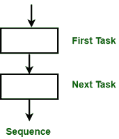
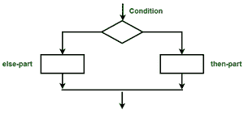
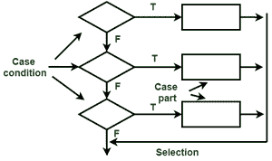
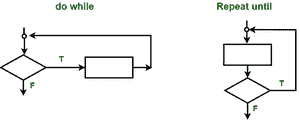

# 工艺设计语言

> 原文:[https://www.geeksforgeeks.org/process-design-language/](https://www.geeksforgeeks.org/process-design-language/)

**过程设计语言(PDL)** 是一种根据设计者的期望精确传达设计的语言。基本上，用于指定系统的设计并将其扩展到逻辑设计。过程设计语言已经在软件的非正式描述中使用了一段时间，并作为自顶向下程序构建的辅助工具。

PDL 是用来表达设计的语言，尽可能精确和明确，没有太多的细节，可以很容易地转换成一个实现。这就是 PDL 试图做的。它是结构化编程语言的外部语法，也有自然语言的词汇。它可以被认为是结构化英语。

**<u>PDL 示例:</u>**

考虑从文件中读取记录的问题。如果文件读取没有完成，并且记录中没有错误，则打印记录的信息，否则打印记录读取中有错误。此过程将持续到整个文件完成:

```
Process (F_Procedure)
Read file
  while not end-of-life
    if record ok then
      print record
    else
      print error
    else if
      read file
  end while
End  
```

To 实现必须转换成编程语言语句。

**<u>编程构造:</u>**

PDL 的基本结构类似于结构化语言。以下是 PDL 使用的条件运算符和循环。

**1。序列构建:**最简单；由此语句按照它们在过程中出现的顺序执行。



**序列构建**

**2。If 构造:**if 构造用于根据给定条件的结果，控制两个或多个路径之一的执行流程。



**if-then-else 构造**

**3。选择构造:**当执行流可能沿两条或多条路径向下流动时，使用选择构造。当有许多条件且值是离散的时，使用选择构造。选择结构中有两个或多个条件。每个条件语句都是一个入口点，除非使用 break 语句，否则执行将从该点继续。break 语句使程序从选择构造的末尾继续。这些条件只能使用离散值。



**选择结构**

**4。重复构造:**当需要连续执行一个代码块直到满足一个条件时，使用重复构造。这种类型的循环用于执行代码块，条件应该为真。



**重复构造**

在 PDL 可以定义和使用多种数据结构，例如列表、表格、标量和整数。

**<u>PDL 优势:</u>**

*   它可以嵌入源代码，因此易于维护。
*   它支持数据和过程的声明。
*   这是改变程序架构最便宜、最有效的方法，

**<u>PDL 的劣势:</u>**

*   它无法以可理解的方式表达功能。
*   只有批注对 PDL 人来说是可以理解的。