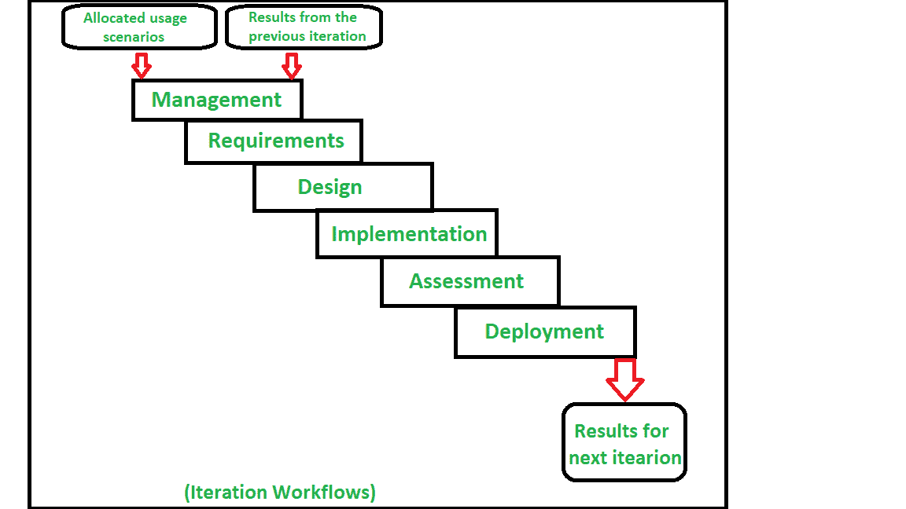

# 软件项目管理中的流程工作流

> 原文:[https://www . geesforgeks . org/process-workflow-in-software-project-management/](https://www.geeksforgeeks.org/process-workflows-in-software-project-management/)

在进入软件项目管理中的软件过程工作流之前，让我们先弄清楚这两个术语:工作流和软件过程工作流

1.  **工作流–**
    一般来说，工作流是指为实现某个目标而执行的一系列连续任务。每个工作流步骤由三个参数定义，即输入、转换和输出。在工作流过程中，会执行一系列操作来实现业务成果。
2.  **软件过程工作流–**
    软件过程是一组相关的活动，这些活动被执行以获得软件产品作为结果，并且在那里软件过程工作流通过执行一系列顺序任务以线性方式领导软件开发。

软件项目管理中有 7 大软件过程工作流–

1.  **管理工作流–**
    控制过程的一些基本步骤在管理工作流中执行。工件包括软件开发计划、商业案例、远景等。
    在软件项目的开发、执行和实施方面，确保利益相关者的双赢条件。
2.  **环境工作流–**
    自动化流程，通过工作流将工具和人员与流程进行协调和集成，从而减少人为错误，并通过更快的资源分配和对问题的响应实现更快的开发。发展维护和更新软件的维护环境。
3.  **需求工作流–**
    分析问题空间，以识别/理解问题并找到解决方案。演进需求工件，例如用例、需求和设计文档/规范，这有助于描述软件的功能、架构和设计。
4.  **设计工作流程–**
    对软件进行建模是为了表达软件设计，其中软件建模将处理整个软件设计。发展架构和设计工件。
5.  **实现工作流–**
    在这个工作流中，设计和架构的实现是通过对组件进行编程来完成的。随着这种植入和部署，工件也在进化。
6.  **评估工作流程–**
    评估流程趋势。产品质量评估是通过分析产品的质量属性和产品的缺陷管理来进行的。
7.  **部署工作流–**
    在该工作流中，执行将最终产品交付给用户的过程，或者准备软件应用程序/产品在特定环境中运行和操作的过程。