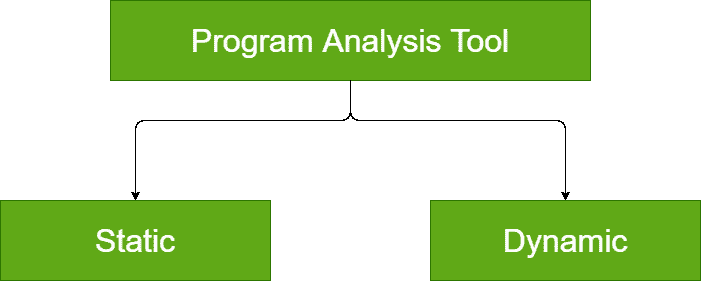

# 软件工程中的程序分析工具

> 原文:[https://www . geesforgeks . org/program-analysis-tools-in-software-engineering/](https://www.geeksforgeeks.org/program-analysis-tools-in-software-engineering/)

**程序分析工具**是一个自动化工具，其输入是程序的源代码或可执行代码，输出是对程序特性的观察。它给出了程序的各种特征，例如它的大小、复杂性、注释的充分性、对编程标准的遵守以及许多其他特征。

**程序分析工具分类:**
程序分析工具分为两类:

**1。静态程序分析工具:**
静态程序分析工具是这样一种程序分析工具，它评估和计算软件产品的各种特性，而不执行它。通常，静态程序分析工具分析程序的一些结构表示，以得出某种分析结论。基本上，使用静态程序分析工具来分析一些结构属性。

通常分析的结构特性有:

1.  是否符合编码标准。
2.  一些编程错误，如未初始化的变量。
3.  实际参数和形式参数不匹配。
4.  已声明但从未使用的变量。

代码遍历和代码检查被认为是静态分析方法，但是静态程序分析工具被用来指定自动分析工具。因此，编译器可以被视为静态程序分析工具。

**2。动态程序分析工具:**
动态程序分析工具是这样一种程序分析工具，它要求程序被执行，其实际行为被观察。动态程序分析器基本上实现了代码。它在源代码中添加额外的语句来收集程序执行的痕迹。当代码被执行时，它允许我们针对不同的测试用例观察软件的行为。一旦软件被测试并且它的行为被观察到，动态程序分析工具执行一个执行后分析并且产生描述已经被程序的完整测试过程实现的结构覆盖的报告。

例如，执行后动态分析报告可以提供关于所实现的范围语句、分支和路径覆盖的数据。

动态程序分析工具的结果以柱状图或饼图的形式呈现。它描述了程序不同模块的结构覆盖。动态程序分析工具的输出可以很容易地存储和打印，并提供已经完成完整测试的证据。动态分析的结果是作为白盒测试执行的测试范围。如果测试结果不令人满意，那么将设计更多的测试用例并将其添加到测试场景中。动态分析还有助于消除冗余测试用例。