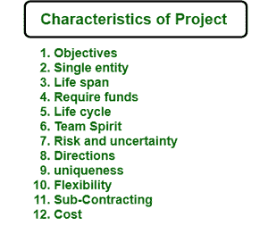

# 项目管理|项目特点

> 原文:[https://www . geesforgeks . org/project-management-特色项目/](https://www.geeksforgeeks.org/project-management-characteristics-of-project/)

项目是在时间表、预算和质量范围内实现特定目标的相关活动的组合。它涉及团队活动的协调，其中经理计划、组织、员工指导和控制以实现目标，并对最终产品的时间、成本和性能进行约束。项目管理是项目和管理的结合。

[规划](https://www.geeksforgeeks.org/software-engineering-project-planning/)是使项目更有效、更好地利用资源实现目标的有力关键。在本文中，我们将关注项目的特征，如目标对实现目标的重要性、项目的总持续时间、计算出的风险和项目的不确定性、项目的总估计成本等。是项目的基本特征，并将讨论项目的其他一些特征，如团队精神、所需资金、方向、独特性、灵活性和分包等。我们一个一个来讨论。

**一个项目的特点:**
项目是**不同质化的**。每个项目本身都是不同的。项目的显著特征如下。

1.  **目标–**
    每个项目都是从某个目标或目的开始的，即。当目标实现时，时间、预算、质量和数量是项目存在的原因。您可以首先定义项目的目标以及实际需要达到的目标。目标是项目的关键特征，在这里你将看到项目的进展，时间分析将向你展示你取得了多大成就的结果。

2.  **单个实体–**
    一个项目就是一个整体。这意味着在一个项目中，尽管不同的人做出了贡献，但仍然被认为是一个单一的实体。团队通常是为一个项目专门组建的。

3.  **寿命–**
    没有一个项目可以永无止境。它必须有一个，超过它就不能前进。每个项目总是有时间限制的。在计划的时候，你会看到项目的时间阶段，团队可以独立地处理项目模块。让我们考虑一个分成三个模块的示例项目，比如说 A、B 和 C。如果一个项目的总时间跨度是 5 个月，那么您可以根据需要独立设置模块的时间跨度，比如 A 可以在 2 个月内完成，B 可以在 2 个月内完成，C 可以在 1 个月内完成。

4.  **需要资金–**
    每个项目都需要资金才能到达终点。没有足够的资金，任何项目都无法成功实施。成本估算是任何组织的基本要素之一。因此，提前计算项目所需的资金将非常有影响。

5.  **生命周期–**
    每个项目都有一个生命周期，有不同的阶段，如开始、成长、成熟和衰退。一个项目必须经过不同的阶段才能完成。让我们考虑一个项目与软件开发相关的例子，然后你可以说软件开发生命周期将是项目的生命周期，在这里你将看到许多阶段，如规划、定义、设计、构建、测试和部署等。

6.  **团队精神–**
    完成项目需要团队精神，因为项目由不同的成员组成，他们有不同的特点，来自不同的学科。但要实现共同目标的和谐，传教士般的热心、团队精神是必要的。

7.  **风险与不确定性–**
    项目一般以预测为主。所以风险和不确定性总是和项目联系在一起。那些没有正确定义的项目将会有很高的风险。只有对风险和不确定性的控制程度随着基于可用信息构思的项目而变化。

8.  **指示–**
    项目始终按照客户给出的时间、质量、数量等指示进行。劳动力、资源和管理人才等经济学供给方的便利性。都是次要问题，主要是客户需求。

9.  **独特性–**
    每个项目都是独一无二的，都有自己的特色。即使组织类型相同，也没有两个项目是相似的。项目的独特性可以通过考虑许多因素来衡量，如目标、项目的特点、项目的应用等。

10.  **灵活性–**
    变化和项目是同义词。一个项目在其整个生命周期中会经历许多变化。这些变化可以使项目更加动态和灵活。

11.  **分包–**
    分包是每个项目的一个子集，没有它，任何项目都无法完成，除非它是一家专有公司或性质很小。项目越复杂，承包的范围就越大。每个项目都需要该领域的外部顾问、工程师或专家的帮助。

12.  **成本–**
    如果要改变项目质量，可能会对项目成本产生影响。如果需要更多的资源来更快地完成项目，成本可能会增加。