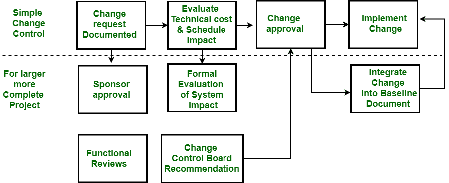

# 项目管理|配置管理和变更控制

> 原文:[https://www . geesforgeks . org/project-management-configuration-management-and-change-control/](https://www.geeksforgeeks.org/project-management-configuration-management-and-change-control/)

控制和记录开发系统变更的过程称为配置管理。配置管理是整体变更管理方法的一部分。它允许大型团队在稳定的环境中一起工作，同时仍然提供创造性工作所需的灵活性。

在这里，我们将讨论配置管理和变更控制，并将涵盖这两者的目标。此外，将重点关注变更控制的过程，并且在本节的后面，将讨论我们如何修改计划以及在计划中进行变更需要遵循的指导原则。我们一个一个来讨论。

**配置管理的目标:**

配置管理有以下三个主要目的。

*   确定产品在不同时间点的配置。
*   系统地控制对配置的更改。
*   在整个产品生命周期中保持配置的完整性和易处理性。

在开发和维护一个项目时，的变化是不可避免的。项目启动时，一个或多个项目的参数会发生多次更改。变更控制的目标是识别、评估、优先考虑和控制项目的变更。如果项目成员或利益相关者有任何请求，就对项目进行更改。

**变更控制的不同角色:**

不同人员和流程在变更控制中的作用如下。

<figure class="table">

| 作用 | 任务 |
| --- | --- |
| 有关的当事人 | 记录所请求的变更，以及变更的优先级，处理变更的方法，如果变更没有实现，则进行处理。 |
| 项目管理人 | 确认变更适用于本项目。 |
| 变更控制委员会 | 将变更请求输入跟踪系统日志。 |
| 项目团队成员 | 审查变更请求，并确定是否值得评估以采取行动。 |

最后，变更必须通知请求者。

**变更控制流程:**

如下图所示。

**修改计划:**

如果项目可交付成果、时间表、预算或方法有重大变化，项目计划需要确定。这也是在每个主要生命周期阶段结束时完成的。修订项目计划的目的是为了适应重大变化，以便记录的计划反映项目团队正在使用的计划。高级经理的任务是审查项目计划的变更并批准这些变更。

进行如下更改时，应遵循以下准则。

*   在不了解其他人的情况下，任何人都不允许改变项目中的任何东西。
*   每一次改变都必须保证质量。
*   应该有一个正式的变更控制系统，在此基础上项目进行变更。
*   该项目应该是灵活的，以便可以很容易地做出改变。
*   变更后的记录将得到妥善维护，修订后的计划也应准备就绪。

需要管理项目范围或产品描述和设计变更的项目应该在出口处有一个配置管理计划。

</figure>