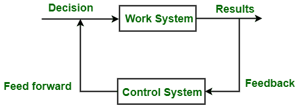

# 软件工程中的项目管理系统

> 原文:[https://www . geesforgeks . org/project-management-system-in-software-engineering/](https://www.geeksforgeeks.org/project-management-system-in-software-engineering/)

在本文中，我们将介绍[项目管理](https://www.geeksforgeeks.org/software-engineering-project-management-process/)系统的概述、功能、组件，还将介绍项目工作系统设计的功能。我们一个一个来讨论。

**简介:**
[项目管理](https://www.geeksforgeeks.org/software-engineering-software-project-management-spm/)系统定义为陈述项目工作系统和项目控制系统的系统。项目管理现在可以定义为通过正常的组织结构和相关个人的专业来实现项目目标的过程。项目管理是处理一个特定的最终目标，以获得结果，或者它可以是面向目标的。为了完成任务，项目经理必须具备以下关键参数。这些是下面给出的有助于整体决策的组成部分。

*   设定目标
*   既定计划
*   组织资源
*   员工
*   设置控件
*   发布指令
*   动机人员
*   将创新应用于替代行动
*   保持灵活性

**项目管理功能:**

*   项目管理的主要功能是说明项目经理需要履行的职能。
*   人们已经认识到团队合作是项目成功实施的关键。
*   项目团队每个成员的积极参与对于项目的成功至关重要。
*   为了实现这一点，有必要开发系统和程序。
*   项目系统是项目实施中所涉及的各种要素的总体情况，旨在协调项目中各种要素的作用和工作**。**

**项目管理系统的**组件:**
在这里，我们将看到项目管理系统，它包括以下组件:这两个组件可以通过下图很好地解释如下。**

1.  **项目工作系统–**
    在这里，您将看到项目工作系统的概述。它是一个系统建模，通过它创建一组相互关联的元素，这样它们就可以在没有外部干预的情况下调节和控制自己。
    **示例–**
    合同系统、设计系统、项目组织从开发工作分解结构开始。有一种技术可以将工作分解成组件，同时在线建立组件之间的连接。为了协调所有子系统并确保项目管理，还需要一个项目控制系统。

2.  **项目控制系统–**
    在此，您将看到项目控制系统的概述。这是一个分析程序和数据收集系统，用于确认和建设性地定义项目的时间、成本和结果，这也有助于决策。项目控制系统也有助于面对外部和内部的混乱。

**项目工作系统设计:**
在这里，您将看到设计项目工作系统时的功能。让我们详细讨论一下。

*   它允许跨职能团队在以新的和根深蒂固的遗留信息系统、多个利益相关者、快速变化的技术监管和竞争环境为特征的环境中重新设计工作流程。支持此类活动的设计和工具的早期经验虽然有希望，但也提出了一些问题。
*   在分析问题领域的过程中，设计团队和他们的主持人会产生大量的信息，通常以标记的简易表格的形式，包含会议、头脑风暴活动、计划、面向目标的活动等。
*   在许多情况下，无论是基于纸张的方法还是计算机方法都没有记录设计或建模决策背后的基本原理，因此只有模型构建者或设计团队成员的记忆才是后来调用基本原理的资源。
*   这被证明是一个关键的限制。当工作重新设计在项目生命周期的不同阶段呈现给多个利益相关者时，项目团队成员很难回忆和阐明设计的所有依赖关系和基本原理。