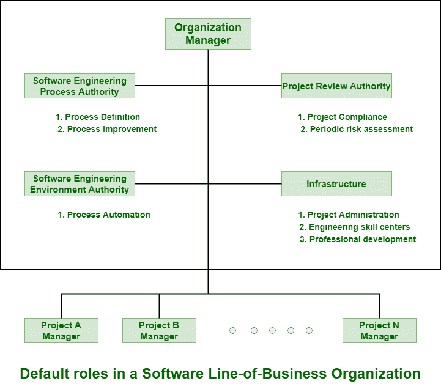
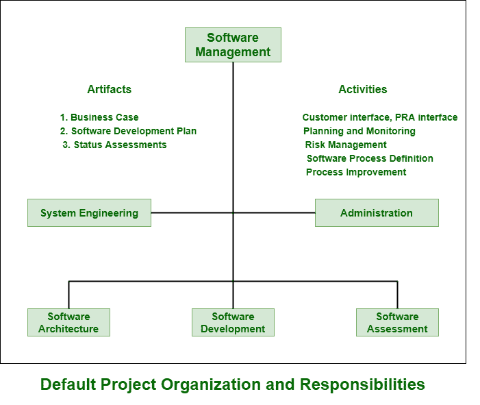

# 项目组织及其职责

> 原文:[https://www . geesforgeks . org/project-organizations-及其职责/](https://www.geeksforgeeks.org/project-organizations-and-their-responsibilities/)

**项目组织**实际上是一种结构，它只是促进和激励项目活动的协调和实施。

他们的主要目的是创造一个环境，鼓励团队成员之间的互动发展，减少干扰、重叠和冲突。项目管理团队最重要的决定是组织结构的形式，这是项目所需要的，也是必不可少的。组织应该随着工作分解结构和生命周期问题而发展。

**业务线组织:**
下图显示了默认业务线组织的角色和职责。业务线组织需要用基础设施来支持项目，这些基础设施对于使用公共流程是必要和必要的。业务范围简单来说就是描述和解释由企业或制造商提供的产品和服务的通用术语。软件业务通常受到投资回报、新业务鉴别、市场多元化和盈利能力的激励和支持。

**组织职责:**

*   他们通常负责过程的定义甚至项目过程的维护。
*   他们还负责过程自动化。这是一个组织角色，与过程定义角色同样重要。
*   组织的角色或过程自动化的角色的责任由单个个人或各种其他团队承担和实现。

**组织各权力机构:**

1.  **Software Engineering Process Authority (SEPA) –**
    It is team that is responsible for exchanging information and guidance of project both to and from project practitioners. The project practitioners simply perform work and are usually responsible for one or more process activities. SEPA is a very important and essential role or responsibility in any of organizations.
2.  **Project Review Authority (PRA) –**
    Project review is simply a scheduled status meeting that is taken on a regular basis. It includes project progress, issues, and risks. It is responsible for project review. The PRA generally reviews both conformance to contractual obligations and organizational policy obligations of project.
3.  **Software Engineering Environment Authority (SEEA) –**
    SEEA is a very important role and is very much needed to achieve an ROI for a common process. It is simply responsible for supporting and managing a standard environment. Due to this, different tools, techniques, and training can be effectively amortized across all types of projects.
4.  **基础设施–**
    组织基础设施通常由系统、协议和各种流程组成，为组织提供结构，支持人力资源，支持组织实现其愿景、使命、目标和价值观。它可以是琐碎的，也可以是根深蒂固的官僚机构。组织基础设施的各个组成部分是项目管理、工程技能中心和专业发展。

下图显示了默认项目组织的角色和职责。项目组织通常需要跨项目团队分配工件和职责，仅仅是为了确保和确认全局(架构)和局部(组件)关注的平衡。

**组织团队:**

*   **项目管理团队–**
    是一个积极且高度热情的参与者。他们负责生产、开发和管理项目。
*   **架构团队–**
    他们通常负责真实的工件，甚至负责组件的集成。他们还发现产品与利益相关者的需求不一致的风险，并简单地确保解决方案符合定义的目的。
*   **开发团队–**
    他们负责生产有效资产所必需的所有工作。
*   **评估团队–**
    他们负责评估可交付成果的质量。