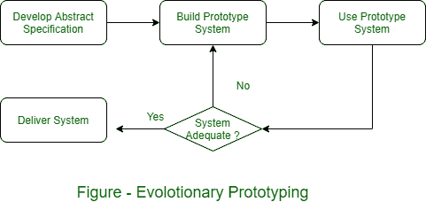
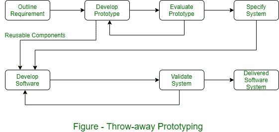

# 软件过程中的原型方法

> 原文:[https://www . geesforgeks . org/prototyping-in-software-process/](https://www.geeksforgeeks.org/prototyping-approaches-in-software-process/)

软件过程中的原型方法如下-

**【1】。进化原型:**
这个原型方法是基于开发一个初始实现的想法，暴露用户评论，并经历几个阶段，直到开发出一个足够的系统，如图所示。

采用这种方法进行软件开发的优势是-

*   **【一】。系统加速交付–**
    业务速度的变化需要软件的改变。快速交付和可用性比描述长期软件可维护性功能更重要。
*   **[b]. User Engagement with the System –**
    The users involvement with the development process is not only to meet their needs, but also means that the system has made a commitment to it and probably wants it to work.

    进化原型法存在一些问题，当开发大型、长寿命系统时，这些问题尤为重要。

    *   **管理问题:**
        软件管理是大型组织处理软件过程模型的关键结构，这些模型生成定期交付以评估进度。
    *   **维护问题:**
        这种类型的问题意味着除了最初的开发者，很难理解任何人。
    *   **合同问题:**
        客户和软件开发人员之间的构建模型是基于系统规范的。没有系统规范，就很难设计系统开发合同。开发商不太可能接受固定价格合同，也无法控制最终用户要求的变更。

**【2】。扔掉原型:**
这种方法通过降低整体生命周期成本来扩展需求分析的过程。原型的主要功能是阐明需求，并为经理提供额外的信息来评估流程风险。根据评估，该原型不用于进一步的系统开发。基于初始抛弃原型阶段的软件过程模型如图所示。

这种方法存在以下问题-

*   原型中省略了重要的特性，以简化快速实现。不可能对系统的一些重要部分进行原型设计，例如安全关键功能。
*   实施在客户和承包商之间没有任何合法合同。
*   涉及可靠性、稳健性和安全性的非功能性要求不能在原型实现中得到充分测试。