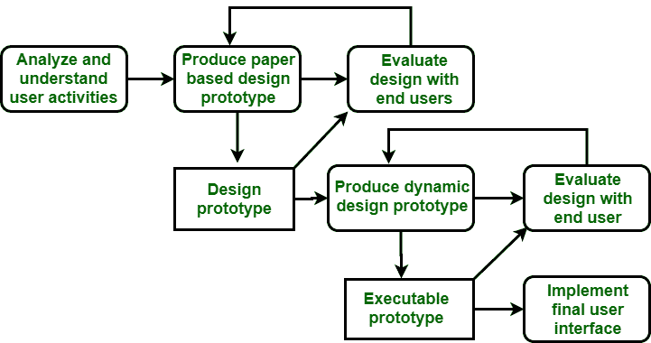

# 良好用户界面设计的品质

> 原文:[https://www . geesforgeks . org/qualities-of-good-user-interface-design/](https://www.geeksforgeeks.org/qualities-of-good-user-interface-design/)

**用户界面**是最常见的前端应用视图和直接人机交互之一，用户可以在其中操作和控制软件以及硬件。它可以包括用于适应机器和用户之间交互的所有方法和设备。用户界面可以有多种形式，但总是能完成两个基本任务:

1.  从机器向用户传递信息。
2.  从用户向机器传递信息。

用户界面设计

**用户界面设计的重要品质如下:**

1.  **简单性:**
    *   用户界面设计应该简单。
    *   完成此任务所需的鼠标点击和击键次数更少。
    *   重要的是，只有当新特性有迫切的需求时，新特性才会增加，并且它们会为应用程序增加重要的价值。
2.  **一致性:**
    *   用户界面应该更加一致。
    *   一致性还可以防止在线设计师信息混乱、模糊和不稳定。
    *   我们应该以一致的方式对所有屏幕组件应用字体、样式和大小约定，这将增加屏幕学习并提高屏幕可读性。在这种情况下，我们可以提供永久对象作为用户可以导航的不变参考点。
3.  **直觉性:**
    *   好的用户界面设计最重要的品质是直观。
    *   直观的用户界面设计是一种易于学习的设计，因此用户可以快速轻松地学会它。
    *   图标和标签应该简洁有力。一个清晰明确的图标有助于使用户界面直观，一个好的做法是使标签符合应用程序支持的术语。
4.  **预防:**
    *   一个好的用户界面设计应该防止用户执行不合适的任务，这是通过在某些条件下禁用或“灰化剪切”某些元素来实现的。
5.  **宽恕:**
    *   这种质量可以鼓励用户充分使用软件。
    *   当用户发现自己到了不该去的地方，设计师应该给用户提供一条出路。
6.  **图形用户界面设计:**
    *   图形用户界面设计提供屏幕显示，为用户创建操作环境，并为用户的操作形成明确的视觉和功能上下文。
    *   它包括标准对象，如按钮、图标、文本、字段、窗口、图像、下拉和弹出屏幕菜单。