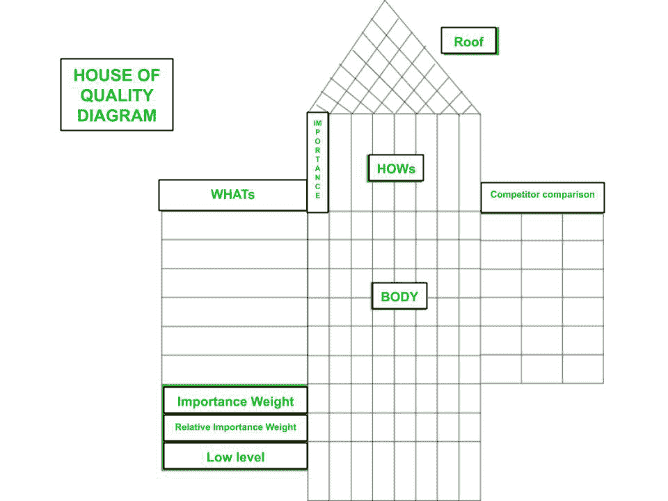
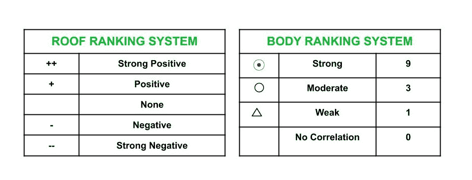
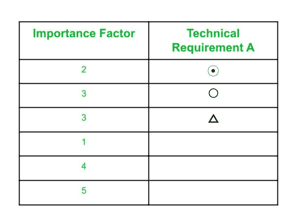

# 软件质量中的质量功能部署(QFD)

> 原文:[https://www . geesforgeks . org/quality-function-deployment-QFD-in-software-quality/](https://www.geeksforgeeks.org/quality-function-deployment-qfd-in-software-quality/)

**质量功能部署(QFD)** 是一个过程或一套工具，用于定义客户对产品的要求，并将这些要求转化为工程规范和计划，从而满足客户对该产品的要求。

*   QFD 是在 20 世纪 60 年代末由日本规划专家赤尾佑司开发的。
*   QFD 的目标是将客户的声音转化为可衡量的详细设计目标，然后将它们从装配层向下推进到子装配层、组件层和生产流程层。
*   QFD 帮助实现产品的结构化规划，使开发团队能够明确指定客户对产品的需求和期望，然后系统地评估产品的每个部分。

**QFD 关键步骤:**

1.  **产品规划:**
    *   将客户的需求转化为一组优先的设计需求。
    *   优先设计要求描述了产品的外观/设计。
    *   包括基准测试-将产品性能与竞争对手的产品进行比较。
    *   设定改进和获得竞争优势的目标。
2.  **零件计划:**
    *   将产品需求规格转化为部分特性。
    *   例如，如果要求产品应该是便携式的，那么特征可以是重量轻、尺寸小、紧凑等。
3.  **工艺规划:**
    *   将零件特性转化为有效且高效的流程。
    *   交付六西格玛质量的能力应该最大化。
4.  **生产计划:**
    *   将流程转化为制造或服务交付方法。
    *   在这一步，也应该提高交付六西格玛质量的能力。

**QFD 的好处:**

1.  **以客户为中心–**
    QFD 的第一步就是了解和收集用户对产品的所有要求和期望。公司不关注他们认为客户想要什么，而是询问客户，关注客户提出的要求和期望。
2.  **客户竞争对手分析之声–**
    质量屋是用于比较客户声音和设计规格的重要工具。
3.  **结构和文档–**
    质量功能部署中使用的工具结构非常好，能够捕捉产品开发过程中做出的决策和吸取的经验教训。该文档可以帮助开发未来的产品。
4.  **低开发成本–**
    由于 QFD 本身在初始阶段就关注和密切关注客户的需求和期望，因此后期设计变更或修改的机会大大降低，从而导致产品开发成本较低。
5.  **更短的开发时间–**
    QFD 流程防止了时间和资源的浪费，因为足够重视客户对产品的需求。由于以正确的方式理解和开发客户需求，因此避免了任何非增值功能或不必要功能的开发，从而不会浪费产品开发团队的时间。

**QFD 工具-质量之家(HOQ) :**
质量之家或 HOQ 是概念图或矩阵，它提供了对客户需求(what)如何与各种技术描述符或设计参数(how)及其优先级相关联的理解。质量屋也被称为**质量矩阵**。矩阵之所以得名，是因为它代表了房子的形状。

质量屋有以下几个部分:

1.  **what–**
    列出了客户的要求和需求。
2.  **重要性因素–**
    团队根据客户需求对客户的重要性水平，从 1 到 5 对每个客户需求进行评分。这里，1 表示最低级别，5 表示对客户最重要的级别。
3.  **how or 吊顶–**
    它包括设计特点、技术描述和符合客户要求的产品规格。
4.  **Body–**
    how 根据它们满足每个列出的 WHATs 的相关性进行排名。使用的身体排名系统是一组符号，用于显示“如何”和“什么”之间的强、中、弱或无相关性。此外，每个符号代表数值。
5.  **屋顶–**
    屋顶表示设计要求(how)如何相互关联。屋顶排名系统使用一组符号来表示不同类型的互动——强正、正、无、负或强负。
6.  **竞争对手比较:**这一部分重点比较竞争对手的产品在实现 WHATs 方面的情况。这也是用 1 到 5 的等级来衡量的，其中 1 表示高度不满意，5 表示高度满意。
7.  **相对重要性–**
    这部分给出的结果是通过将每个 how 的重要性乘以身体等级符号的值来计算它们的总和。这一部分很有用，因为它允许我们确定需要更多关注和资源的产品的方式。
8.  **较低层次或基础–**
    HOQ 的这一部分列出了与如何满足客户要求相关的技术规范的更具体的目标值。

参见下面的 **HOQ 图**:



**车顶排名系统**和**车身排名系统**如下:



计算重要性权重和相对重要性权重的公式:

```
Importance Weight, 
= Sum of (Importance Factor * Body Ranking Symbol Value) 
```

在列中

```
Relative Importance Weight, 
= (Importance Weight/ Total Importance Weight) * 100 
```

例如，如果 HOWs 中的列如下:




```
Importance Weight (A) 
= (2 * 9 + 3 * 3 + 3 * 1) 
= 18 + 9 + 3 
= 30 
```

同样，计算其他技术要求的重要性权重。