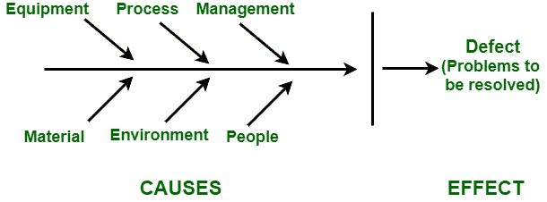

# 软件工程中的质量规划

> 原文:[https://www . geeksforgeeks . org/软件工程中的质量规划/](https://www.geeksforgeeks.org/quality-planning-in-software-engineering/)

**质量保证是项目规划过程中的关键促进过程之一。这是一项持续的活动，与其他计划流程一起执行。质量计划旨在确定相关的质量标准，将质量标准纳入产品和过程，确定如何实现这些标准。**

**在项目经理为质量做计划之前，他必须知道标准期望是什么。换句话说，他必须了解组织最高管理层定义的质量方针。它规定了最高管理层正式表达的组织在质量方面的总体意图。应该记录下来。项目团队应采用组织的质量方针来指导项目实施。如果没有涉及多个执行组织的质量政策或项目，在合资企业的情况下，那么项目管理团队应该创建质量政策。项目干系人应充分了解质量政策。**

**项目范围声明是质量计划的另一个重要输入。它定义了质量计划的重要输入。它定义了什么将作为项目的一部分交付，什么不交付，以及关于成本、进度和成本的项目目标。质量计划的其他输入包括对将要设计的产品的描述、可能影响项目的标准和法规以及其他过程的输出。**

**一旦项目经理收集了所需的输入并评估了产品描述和质量保证，他就能够衡量质量。质量测量用于进行评估、跟踪项目进度、分析缺陷和实现持续改进，以及评估工具。项目经理使用以下几种技术来规划质量:**

*   ****效益/成本分析:**
    是估算各种项目质量管理活动的成本和效益的过程。满足质量的主要好处是减少返工，从而提高生产率，降低成本，提高客户满意度。满足质量要求的主要成本是与质量管理活动相关的成本。优质涂层通常有两种类型:

    *   **符合要求的成本:**
        完成项目工作以满足预期质量水平和项目范围的成本。示例:预防成本和评估。

    *   **不符合成本:**
        包括因某种故障产生的成本，内部故障相关成本包括客户收到产品前发生的成本，以及客户收到产品后发生的外部故障相关成本。成本也很高。例如:启动成本、项目相关成本、持续成本。** 
*   ****基准测试:**
    它涉及将项目实践与同一组织内的其他项目或与其他公司的项目实践进行比较。这样做是为了产生改进的想法，并为测量提供基础。** 
*   ****Creating a Flowchart :** 
    A flowchart is any diagram that shows how various components of a system are interrelated. There are two types of flowcharts used in quality management. These are –

    **1。系统或过程流程图:**
    它显示了一个系统的各个元素是如何相互关联的。它显示了整个系统的流程。

    **2。因果图:**
    又称石川图或鱼骨图。它显示了流程中的变量是如何关联的，以及这些关系如何产生潜在的问题。** 

**

鱼骨图** 

*   ****实验设计:**
    这是一种与假设情景相关的分析技术，用于确定项目中哪些变量对整体结果影响最大。这种方法通常与产品设计有关；它也可以应用于项目管理遇到的问题，例如成本和进度权衡。一个优化设计的实验，计算项目成本，以及考虑不同员工组合的持续时间将提供一个最佳解决方案。**

**质量计划过程的结果是找到实施质量方针的方法。**