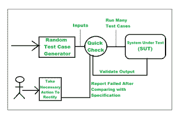

# 软件测试中的随机测试

> 原文:[https://www . geesforgeks . org/random-testing-in-software-testing/](https://www.geeksforgeeks.org/random-testing-in-software-testing/)

随机测试是[软件测试](https://www.geeksforgeeks.org/software-testing-basics/)，借助生成随机独立的输入和测试用例对系统进行测试。随机测试也被称为猴子测试。这是一种黑盒评估大纲技术，其中测试是随机选择的，结果通过一些软件识别进行比较，以检查输出是正确的还是不正确的。

#### **关于随机测试的一些要点:**

1.  梅尔文·布鲁尔在 1971 年首次检验了随机测试。
2.  1975 年，Pratima 和 Vishwani Agrawal 对该测试进行了初步评估，以检查软件的成功输出。
3.  对于随机测试，也有一本书，里面包含了一些公式，可以进行的测试数量以及成功结果和失败结果的数量。

### **工作随机测试:**

**步骤 1:** 识别输入域

**步骤 2:** 从输入域中独立/随机选择测试输入

**步骤 3:** 在这些输入上测试系统，并形成随机测试集

**步骤-4:** 将结果与系统规格进行比较

**步骤 5:** 如果报告失败，则采取必要的措施。

下图更清晰地展示了随机测试的工作方式。

随机测试的工作

### **随机测试类型**

**1。随机输入序列生成:**也称为随机数生成器(RNG)，其中生成随机选择期间无法假设的随机序列号或符号。

**2。数据输入的随机序列:**在这种情况下，所有的数据都是随机选择的，用于测试期间可以使用的输入。

**3。从现有数据库中随机选择数据:**所有数据均可从该记录中获得的记录，只有数据可被选择用于随后的测试，不能添加记录中不可用的额外数据。

### **随机测试的特征:**

1.  当应用程序中的错误没有被识别出来时，随机测试就被实现了。
2.  它用于检查系统的执行和可靠性。
3.  它节省了我们的时间，不需要任何额外的努力。
4.  随机测试的成本更低，它不需要额外的知识来测试程序。

### **实施随机测试的方法:**

为了基本实现随机测试，应用了四个步骤:

1.  分析用户输入域。
2.  然后，从该域中，分别选择测试输入的数据。
3.  在这些测试输入的帮助下，测试成功执行。这些输入测试进行随机测试集。
4.  将结果与系统标识进行比较。如果任何测试输入与原始输入不匹配，测试的结果就会变得不成功，否则结果总是成功的。

### 随机测试的优势

1.  它非常便宜，所以任何人都可以使用这个软件。
2.  在测试过程中，它不需要任何特殊的智能来访问程序。
3.  错误很容易追踪；它可以在整个测试过程中轻松检测到错误。
4.  该软件缺乏偏见，这意味着它使测试组均匀，它不喜欢重复检查错误，因为在整个测试过程中代码可能会有一些变化。

### 随机测试的缺点

1.  该软件仅发现更改错误。
2.  它们不实用。有些测试在很长一段时间内都没有用。
3.  大部分时间是通过分析所有的测试来消耗的。
4.  如果新测试的数据在测试期间不可用，则无法形成新测试。

### **用于随机测试的工具**

1.  **QuickCheck:** 这是一个著名的测试工具，是为 Haskell 引入的，它有很多不同的语言版本。该工具为与模型和系统属性相关的应用编程接口调用生成随机订单，可以在每次测试后给出成功的结果。
2.  **Randoop:** 该工具在测试过程中为类提供方法和构造函数确认的顺序，并生成 JUnit 测试。
3.  **Simulant:** 它是一个 Clojure 工具，根据系统的不同规格、模型的行为运行。
4.  **Gram Test:** 这个随机测试工具基于用 Java 编写的语法，它利用 [BNF 符号](https://www.geeksforgeeks.org/bnf-notation-in-compiler-design/)来指定在测试过程中用作输入的语法。