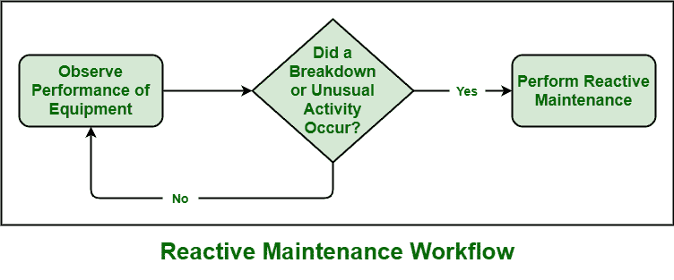

# 软件工程中的反应式维护

> 原文:[https://www . geesforgeks . org/reactive-maintenance-in-software-engineering/](https://www.geeksforgeeks.org/reactive-maintenance-in-software-engineering/)

**反应式维护**顾名思义，是在已经发生故障时应用的一种维护策略。在这种情况下，设备、组件等资产。只有在发生故障或出现故障或性能不佳时，才能进行维修并恢复正常运行功能。它只是遵循牛顿第三运动定律，即“对于每一个动作，都有一个相等且相反的反作用力”。它简单地描述了力的本质和人性，根据需要对任何行为做出反应。

同样的，**反应性维护**也是在资产损坏或故障后进行修复。启动反应性维护，在某些情况下是设备故障，需要维修，或者将设备恢复到正常状态。但是人们应该寻找其他的保养策略，就像有人说的“预防胜于治疗”。防止设备故障，总比故障后修理好。

**优势:**
无功维护有如下几个优势:

1.  **需要更少的时间和金钱:**
    显然，如果有人不维护未破损的设备，那只是意味着维护设备不需要成本。钱是省下来的，而不是花在设备维护上。简而言之，我们可以说一个人可以通过什么都不做来节省金钱和时间，而不是通过做一些事情来花费时间和金钱。在反应式维护中，这类似于通过不维护设备来节省金钱和时间。
2.  **需要更少的成员:**
    在预防性维护中，需要额外的成员来维护设备，他们必须定期检查设备的状况。在这种类型的维护策略中，不需要维护设备，因此在设备故障后，需要较少的成员来执行维修。故障后需要一小组成员进行维修。
3.  **不需要规划:**
    在预防性维护中，需要大量的规划来维护设备，防止设备出现故障。但是，在反应式维护中，需要较少的计划，因为不需要为防止设备故障进行计划。

**缺点:**
无功维护除了优点以外，还有如下几个缺点:

1.  **安全问题:**
    当做好适当的计划，以预定和适当的方式执行每项任务时，人们就可以完全安全地维护和执行任务。但是在反应式维护中，工作团队承受着压力，因为在这种类型的维护策略中没有进行规划。如果没有采用适当的维护策略，同样的问题也可能在维修后再次出现。
2.  **更贵:**
    如果没有应用适当的维护策略，那么系统可能在工作时间或生产过程中随时出现故障。它会对整个系统造成更大的损害，并可能导致产量下降和维修成本增加。
3.  **耗时:**
    反应式维护更耗时，因为在故障后，团队成员花费更多时间采取纠正措施来维修设备。这也导致生产延迟。
4.  **资源利用效率低下:**
    设备的维修需要更多的资源利用，也很耗时。一个人需要订购纠正零件，并等待发放。