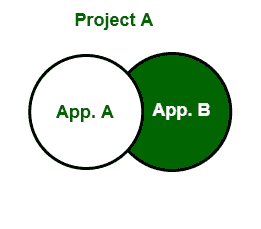
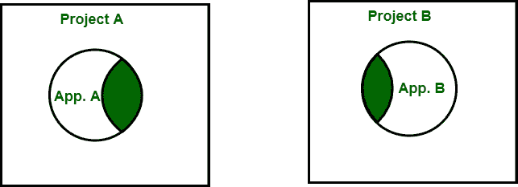
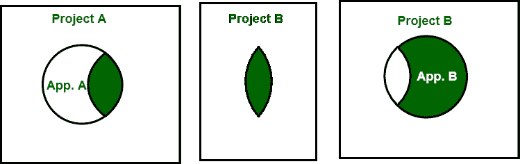

# 重用成熟度模型

> 原文:[https://www.geeksforgeeks.org/reuse-maturity-model/](https://www.geeksforgeeks.org/reuse-maturity-model/)

**软件复用**是从现有的软件系统中创建软件系统的过程，而不是从头开始构建软件系统。"

**重用成熟度模型:**
它基于软件开发组织内部的经验以及与其他开发组织的经验和观察。

**LEVEL-1:基于单个项目源代码的重用–**
在第一个成熟度级别，组织将其所有源代码放在单个项目中。此后，单一源代码池将容纳多个应用程序，如下图所示:

图:一级

项目 A 是两个应用程序 A 和 b 的所在地。没有必要将源文件或编译文件从一个项目复制到另一个项目，因为只有一个项目。但这种做法的推广程度是有限度的。当应用程序数量或开发人员数量增加时，维护单一源代码将变得困难。

**LEVEL-2:多项目基于源代码的重用–**
在这个阶段，源代码被分成多个项目，并在项目之间实践基于源代码的重用。在这种情况下，基于源代码的重用将一个项目中开发的源代码复制到另一个项目中。这种重用的主要目标是实用程序，它可以在一个项目中开发，也可以在另一个项目中使用。如下图所示:

图:二级

项目 A 是应用程序 A 的宿主，项目 B 是应用程序 B 的宿主。两个项目共有的代码被复制到两个项目中。

这样做的问题是，在复制之后，重用的源代码必须链接回原始代码。这导致了各种各样的维护问题，因为 bug 修复必须应用到重用复制代码的每个项目中。此外，两个宿主项目会进化，重用代码也会随之进化，这使得维护更加困难。

**LEVEL-3:临时二进制重用–**
这是 level 2 之后的下一步。组织提升到第一级，会意识到第二级缺点。在这种方法下，项目边界重新对齐，不再有镜像边界。这个级别的项目，可以对应应用。以前从一个项目复制到另一个项目的实用程序源代码现在被放在自己的项目中，并且有自己独立于应用程序项目的生命周期。

应用程序项目包括实用程序项目的二进制工件，并且项目之间建立了依赖关系。公用事业项目的维护大大简化，因为不需要维护公用事业的多个不同副本，只需要维护单个版本。此外，应用程序需要额外的功能，因此应用程序功能对所有使用实用程序的应用程序都可用，如下图所示:

**图:三级**

但是在这种情况下，没有发布过程或依赖关系管理过程。添加新功能使得不可能知道应用程序中使用的实用程序的确切版本。此外，当发现 bug 时，很难知道基于哪个版本的代码包含 bug。实施修复后，很难知道最新版本是否与所有需要实用程序库的应用程序项目兼容。

**LEVEL-4:受控二进制重用和重用/发布等价原则–**
它基于特定的二进制重用。应用程序项目和组件项目的项目边界保持不变。在这个级别上，项目的每个版本都由一个版本号来控制和跟踪。

在这个级别上，当发现 bug 时，可以识别出带有 bug 的组件的确切版本。