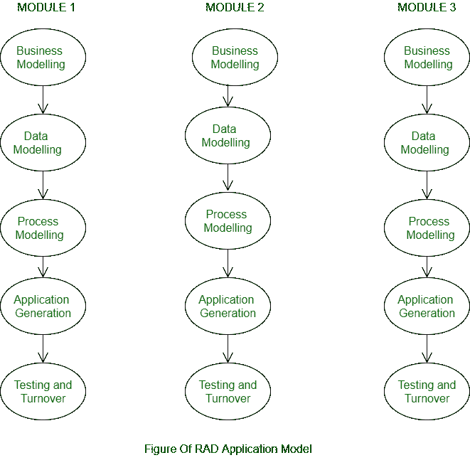

# 快速应用模型的正确方法

> 原文:[https://www . geesforgeks . org/right-approach-for-rapid-application-model/](https://www.geeksforgeeks.org/right-approach-for-rapid-application-model/)

**快速应用模型的正确方法:**
RAD 是一个直接连续的编程进步度量模型，它强调利用基于组件的开发方法的紧凑的改进周期。如果必要条件确实是已知和描述的，并且任务程度是一个限制，RAD 循环授权一个推进小组在一个紧凑的时间跨度内制作一个完全实用的框架。

**快速应用开发(RAD)**是一种可以通过以下方式更快、更高质量地生长物品的想法

1.  利用工作坊或中心聚会的社会事务先决条件。
2.  原型制作和计划的早期重复客户测试。
3.  编程部分的再利用。
4.  一个不固定进度的计划，暗示了对以下项目形式的计划增强。
5.  较少出现在评论和其他收集信件中。

**RAD 的不同周期如下:**

1.  **业务建模–**
    业务能力之间的数据流的特点是解决诸如什么信息驱动业务周期、什么信息被创建、谁产生信息、数据去哪里、谁测量信息等问题。
2.  **数据建模–**
    从业务展示中收集的信息被细化为一堆有望帮助业务的信息对象(元素)。质量(每个元素的特征)被区分，并且这些信息对象(物质)之间的联系被表征。
3.  **流程建模–**
    在信息展示阶段表征的数据对象被改变，以完成对执行业务工作很重要的信息流。处理描述是为了添加、更改、擦除或恢复信息对象而制作的。
4.  **应用生成–**
    利用机械化仪器鼓励产品开发；甚至他们利用第四 GL 策略。
5.  **测试&周转率–**
    自从 RAD 强调重用以来，已经尝试了相当多的编程部分。这减少了一般测试时间。尽管如此，新的部分应该被尝试，所有的接口应该被完全设计出来。

**何时利用 RAD 模型？**

*   当框架必须在有限的专注能力(2-3 个月)内进行模块化的冒险时。
*   当必需品引人注目的时候。
*   当特殊危险受到限制时。
*   当需要制作一个框架时，在 60-90 天的时间内模块化。
*   只有当财务计划允许使用编程代码创建设备时，才应该使用它。

**RAD 型号首选位置:**

*   这种模式能适应变化。
*   RAD 中的每个阶段都为客户带来了最值得注意的需求有用性。
*   它减少了进步的时间。
*   它建立了高光的可重用性。

**RAD 模型的负担:**

*   要求包含客户。
*   论高度专业化的危险，这是不合理的。
*   对于更温和的企业，我们不能使用 RAD 模型。
*   不是所有的应用程序都适用于 RAD。
*   它需要特别有天赋的原创者。