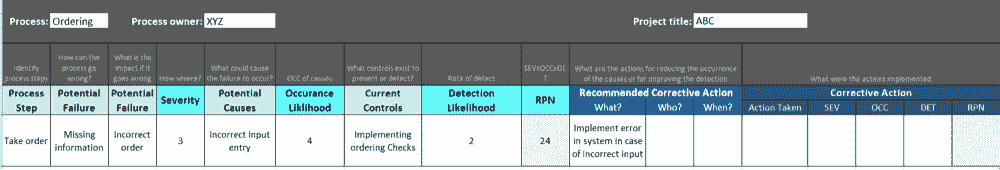

# 基于风险的测试和故障模式及影响分析

> 原文:[https://www . geesforgeks . org/基于风险的测试和故障模式及影响分析/](https://www.geeksforgeeks.org/risk-based-testing-and-failure-mode-and-effects-analysis/)

[风险](https://www.geeksforgeeks.org/different-types-of-risks-in-software-project-development/)是负面或不良结果或事件的概率。风险是任何可能出现的问题，这些问题会降低客户、用户、利益相关者对质量和/或项目成功的看法。

**风险类型:**
风险有 2 种——产品风险和质量风险。

1.  **产品风险-**
    当潜在问题的主要影响在**产品质量**上时，则该潜在问题称为产品风险。也可以称之为质量风险。**示例-** 可能导致系统崩溃或金钱损失的缺陷。
2.  **项目风险-**
    当潜在问题的主要影响在时，项目的整体成功***这些潜在问题被称为项目风险。它们也可以称为计划风险。示例-可能会延迟项目完成的人员配备问题。***

***不是所有的风险都同等重要。我们可以通过多种方式对风险等级进行分类。最简单的方法是看两个因素-***

1.  *****问题发生的可能性**。可能性来自技术考虑。***
2.  *****影响** 的问题，如果发生的话。影响来自业务考虑。***

*****什么是基于风险的测试？**
在[基于风险的测试](https://www.geeksforgeeks.org/risk-management-steps-in-software-engineering/)中，我们使用风险分析期间确定的风险项目，以及与每个风险项目相关的风险水平来指导测试。这是一种主要基于风险概率的软件测试技术。基于风险的测试包括以下步骤:***

1.  ***基于软件质量评估风险。***
2.  ***使用频率。***
3.  ***业务的重要性。***
4.  ***可能存在缺陷的区域等。***

*****基于风险的测试的特征(RBT):**
以下是基于风险的测试的一些特征(RBT)-***

1.  ***RBT 策略将测试工作的水平与风险水平相匹配。风险越高，测试工作量就越大。这适用于测试执行以及其他测试活动，如测试设计和实现。***
2.  ***它将测试的顺序与风险级别相匹配。风险较高的测试往往会发现更多的缺陷，或者与应用程序中更重要的领域相关，或者两者都有。因此，风险越高，我们就越早在周期中计划测试——无论是设计还是执行。这也有助于建立商业利益相关者的信心。***
3.  ***通过努力分配和维护测试的顺序，质量风险得到系统和可预测的降低。通过维护测试与风险和风险识别缺陷的可追溯性矩阵，将风险报告为剩余风险是有意义的。这使得相关的利益相关者可以决定何时停止测试，即当继续测试的风险超过测试完成的风险时。***
4.  ***如果日程缩减需要范围缩减，那么决定什么需要出去就更容易了。当风险等级达成一致时，它总是可以被业务涉众接受和解释的。***
5.  ***为了识别风险，我们需要从各种来源获取输入，如需求规格、设计规格、现有应用程序数据、以前的事件记录等。但是，如果这些信息不容易获得，我们仍然可以使用这种方法，从风险识别和评估过程的利益相关者那里获得输入。***

***在这里，请注意，由于对上游流程(如需求收集)的依赖性在一定程度上有所降低，依靠很少或没有文档的能力使得这种测试策略更加稳健(如果不是防故障的话)。***

*****何时实施基于风险的测试？**
基于风险的测试方法在以下场景中实施-***

1.  ***存在时间/资源或预算限制。例如，要在生产中部署的修补程序。***
2.  ***当一个概念证明被实现的时候。***
3.  ***当团队不熟悉技术平台或测试中的应用程序时。***
4.  ***在增量模型或迭代模型中测试时。***
5.  ***安全测试在云计算环境中进行。*** 

*****基于风险的测试是如何实施的？**
风险可以通过多种方式指导测试，但以下是主要的方式***

1.  ***测试经理按照与测试项目相关的风险比例分配工作。***
2.  ***根据测试项目的风险等级，测试技术的选择应符合所要求的严格性和广泛性。***
3.  ***测试活动应按照风险的逆序进行，即应首先测试最高风险项目。***
4.  ***缺陷的优先排序和解决应根据相关的风险水平进行。***
5.  ***在测试计划和控制过程中，测试经理应对所有重大风险项目进行*风险控制*。关联的风险级别越高，就应该控制得越彻底。***
6.  ***应根据剩余风险进行报告。示例-哪些测试还没有运行？哪些缺陷还没有修复？***

***需要注意的是，风险管理不是在项目开始时发生的事情。这应该是一个贯穿项目生命周期的****活动。然而，风险的性质根据我们所处的测试阶段而不断变化。
风险应定期****进行评估，并根据项目的新进展评估风险等级。这可能会导致一些风险被低估甚至关闭。根据结果，测试工作分配和其他测试控制活动也将发生变化。
此外，应努力通过运行测试、发现缺陷来降低质量风险，并通过缓解和应急措施来降低项目风险。***********

*********基于风险的测试的好处(RBT):**
通过识别和分析与系统相关的风险，可以使测试高效且有效-*******

1.  *******高效-**
    RBT 之所以高效，是因为你在周期的早期测试了系统最关键的区域(缺陷检测得越早，解决这些问题的成本就越低)*****
2.  *******有效-**
    RBT 之所以有效，是因为你的时间是根据风险评级和缓解计划来花的。你不会把时间花在那些在整体计划中可能不太重要的项目和活动上。*****
3.  *******减少的测试用例-**
    随着测试用例变得更加集中，测试用例数量会减少。*****
4.  *******成本降低-**
    随着关键问题在周期早期得到解决，每质量成本降低，从而降低变更成本。*****
5.  *******更快的上市时间-**
    使用 RBT 方法更容易实现更快的上市时间，因为在周期的早期，最重要的功能都在可发货的位置。*****

*******故障模式和影响分析(FMEA):**
FMEA 是一种系统技术，用于识别被称为故障模式的质量风险项目，即它识别被测系统可能在哪里以及如何发生故障，然后评估不同故障的相对影响。
流程涉及的步骤有:*****

1.  *******失效模式-**
    什么会失效？*****
2.  *******失败原因-**
    为什么会失败？*****
3.  *******失败效应-**
    每次失败的结果会是什么？*****

*****FMEA 方法是迭代的，即剩余风险的重新评估需要重复进行。这项技术最初是为了在设计和实现阶段帮助防止缺陷，因此有望在周期的早期使用。
当故障模式分析对用户产生影响时，需要进行细粒度的分析，同时也需要识别客户。由于需要这种深度的分析，FMEA 文件可能会很复杂。
多用于安全关键、高风险、保守的项目。例如——工业控制软件、核控制软件等。
FMEA 在实施前评估新流程以及评估提议的变更对现有流程的影响方面非常有用。*****

*******FMEA 进程:**
本节详细介绍 FMEA 进程。以下是步骤-*****

*******1。查看流程-** 使用流程图确定每个流程组件，并在 FMEA 表中列出每个流程组件。
T3】2。识别潜在的故障模式并绘制其潜在影响图-*****

1.  *****查看现有的文档、设计和数据，找出每个组件无法列出详尽清单的方式。*****
2.  *****将每个故障映射到每个故障对最终产品或流程后续步骤的影响。*****
3.  *****为每个故障指定严重性。*****

<figure class="table">

| **严重性等级** | **描述** |
| Ten | 危险，没有警告 |
| nine | 危险，带有警告 |
| eight | 非常高 |
| seven | 高的 |
| six | 温和的 |
| five | 低的 |
| four | 极低 |
| three | 较小的 |
| Two | 非常小 |
| one | 没有人 |

</figure>

*******3。一旦确定了影响和严重性，也要分配事件等级。*******

1.  *****事件是与故障模式及其相关原因将出现在被分析的项目中的可能性相关联的排名数字。事件等级具有相对意义而不是绝对值，并且是在不考虑检测的严重性或可能性的情况下确定的。*****
2.  *****对于系统和设计 FMEAs，发生排序考虑了产品设计寿命期间发生的可能性。*****

<figure class="table">

| **发生等级** | **描述** |
| Ten | 每 1，000 人超过 100 人 |
| nine | 每 1000 人中有 50 人 |
| eight | 每 1000 人中有 20 人 |
| seven | 每 1000 人中有 10 人 |
| six | 每 1，000 人中有 5 人 |
| five | 每 1，000 人中有 2 人 |
| four | 千分之一 |
| three | 千分之 0.5 |
| Two | 千分之 0.1 |
| one | < 0.01/1000 |

</figure>

*******4。分配检测等级*******

1.  *****检测等级根据定义的标准考虑检测到故障模式/原因的可能性。*****
2.  *****检测是特定 FMEA 范围内的相对排名，其确定不考虑发生的严重程度或可能性。*****

<figure class="table">

| **检测等级** | **描述** |
| Ten | 绝对不可能 |
| nine | 非常遥远 |
| eight | 遥远的 |
| seven | 极低 |
| six | 低的 |
| five | 温和的 |
| four | 中等偏高 |
| three | 高的 |
| Two | 几乎可以肯定 |
| one | 某些 |

</figure>

*******5。计算风险优先级数。*******

1.  *****RPN 通过将三个评分栏相乘来计算-

    1.  严重性(第 2 点)。
    2.  事件(第 3 点)。
    3.  检测(第 4 点)。***** 

*******6。根据 RPN 制定行动计划。*******

1.  *****根据风险优先级数字决定应该优先处理哪些故障。最高优先级的路由器获得最高优先级。*****
2.  *****定义行动计划、负责人和预期完成日期。*****

*******7。实施行动计划。*******

*******8。重新评估并重复。*******

1.  *****改进完成后，重新评估每个潜在的故障，并确定改进的影响。*****
2.  *****重复该过程以确定下一步操作。*****

*****

FMEA 模板***** 

*******FMEA 的好处:**
下面是 FMEA 的好处——*****

1.  *****正是精准的和彻底的因而更不可能省略风险。*****
2.  *****它给出了潜在问题的整体视图，因为我们需要对预期的系统故障进行详细分析*****
3.  *****它为不做某些测试提供了理由，即在失败概率最小的地方。*****

*******FMEA 的挑战:**
以下是 FMEA 的挑战-*****

1.  *****它需要大量的文档，因此非常耗时。*****
2.  *****当试图确定失败的原因时，从中间结果中确定真正的原因可能是具有挑战性的。*****
3.  *****许多组织没有认识到 FMEA 不是一个静态模型。为了成功进行风险管理，应定期更新 FMEA，因为新的潜在故障模式已被识别，相应的控制计划也已制定。*****