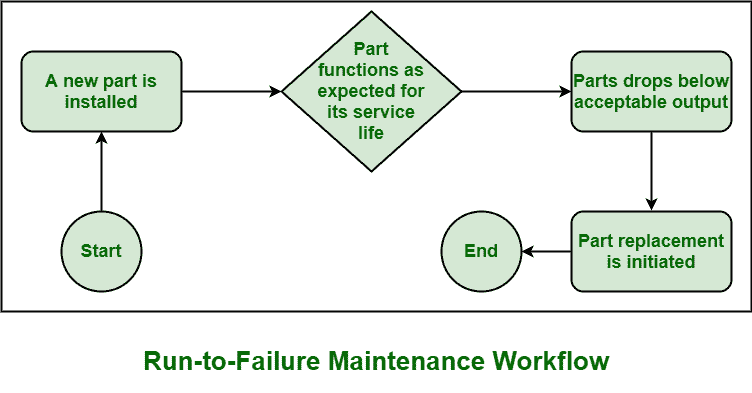

# 运行至故障(RTF)维护

> 原文:[https://www . geesforgeks . org/run-to-failure-rtf-maintenance/](https://www.geeksforgeeks.org/run-to-failure-rtf-maintenance/)

**[【运行至故障(RTF)】](https://www.geeksforgeeks.org/applications-of-rtf-maintenance/)**维护，也称为适合并忘记维护，是一种遵循简单规则的维护策略，即等到故障发生。必须等到设备出现故障，即等到设备出现故障或出现故障。故障后，可以修复或更换。这是一种具有成本效益的策略，只有当故障的影响和后果是可以容忍的，并且与设备故障及其维修相关的成本很少或可以忽略不计时，才适用。

这种策略现在被一些拥有各种设备的公司和组织广泛使用。这种维护策略是计划外的，但实际上，它是一种计划策略，旨在降低设备的维护成本。一旦出现故障，团队成员也准备好采取措施和行动。

**优势:**
RTF 有如下几个优势:

1.  **最小计划:**
    由于故障前不需要维护，因此计划在这种类型的维护策略中并不那么重要。仅在故障发生后才需要进行维护，而不是在故障发生前进行维护。
2.  **Cost-effective :**

    RTF 是一种具有成本效益的策略，它通过简单地消除设备的维护成本来节省资金。该策略不涉及设备故障前的维护，因此维护成本是安全的。

3.  **易于理解:**
    由于维护策略需要非常少或最少的规划，因此可以很容易地理解这种维护策略的工作原理。由于它的简单性，人们可以毫无问题地轻松实现它。

**缺点:**
除了优点，RTF 还有如下几个缺点:

1.  **不可预测:**
    有几种故障是不可预见的，即无法预测的。因此，人们无法确定特定资产何时需要维修或更换。因此，有时解决问题变得非常困难，这可能会在未来造成更大的损害。
2.  **不一致:**
    在这样的维护策略中，故障通常发生或报告发生在特定设备或资产的使用过程中。分析时未发现故障，但故障发生在资产使用过程中。此类故障被视为间歇性故障，可能是由 NFF(未发现故障)事件引起的。因此，很难就修复它和修复它所需的资源进行有效的规划。
3.  **成本高昂:**
    这样的维护策略也可能非常昂贵。有时故障会导致更大的损坏，需要更多的资源来修复。这将导致维修成本增加。这又增加了生产成本、与执行维护相关的人工成本。