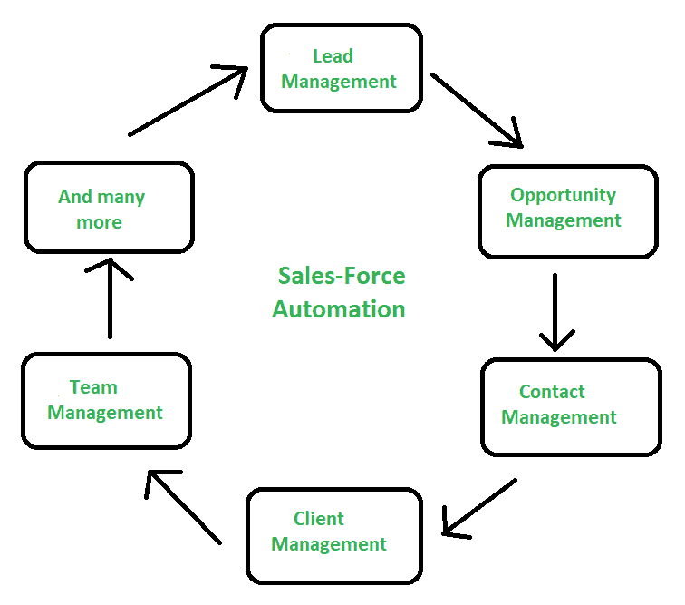

# 销售力量自动化

> 原文:[https://www.geeksforgeeks.org/sales-force-automation/](https://www.geeksforgeeks.org/sales-force-automation/)

**销售人员自动化**技术有助于跟踪销售人员的表现，因为他们在推动销售和潜在客户的联系信息方面发挥着重要作用，因此会影响业务收入。这就是 SFA 存在问题的原因——客户的需求如何以及何时改变，需求是什么，以及这些事情如何影响业务。

它是一种信息技术工具，通过协调内部流程和后端数据库系统，将技术和信息集成在一起，以自动完成销售人员和销售经理的销售任务。因此，在某个地方，SFA 作为一种技术或信息技术工具出现了，它提供了跟踪和记录人员或销售人员销售情况的数据库系统。它有助于分析数据，这对于销售计划、销售预测和战略制定是有效的。

它为您提供了销售线索管理、机会管理、联系人管理、客户管理、团队管理、活动管理等功能。

**特征:**

*   从潜在客户登陆您的网站的那一刻起，销售人员自动化软件就可以开始收集他们的信息。跟踪他们看的产品和他们通过你的网站的路径，可以建立一个轮廓档案。
*   机会管理
*   工作流管理
*   电子邮件管理

**优势:**

*   它跟踪销售业绩
*   效率更高
*   监控交付周期
*   团队协作
*   易接近

**缺点:**

*   数据输入耗费大量时间
*   难以整合
*   有时销售自动化学习起来可能相当复杂

My Personal Notes *arrow_drop_up*<textarea maxlength="5000" id="enteredPersonalNote" class="personalNoteStyle" placeholder="Add your personal notes here! (max 5000 chars)">
<button class="savePersonalNoteButton" onclick="saveUserPersonalNote()">Save</button>

 </body></html></textarea>