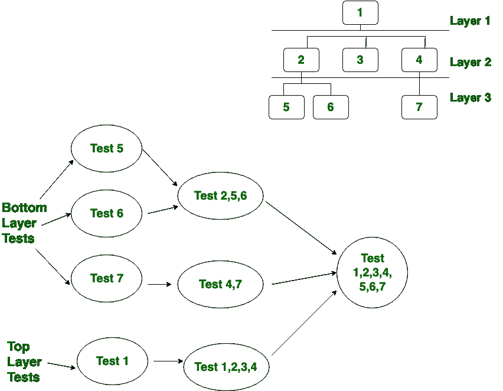

# 三明治测试|软件测试

> 原文:[https://www . geesforgeks . org/三明治-测试-软件-测试/](https://www.geeksforgeeks.org/sandwich-testing-software-testing/)

先决条件–[软件测试|基础知识](https://www.geeksforgeeks.org/software-testing-basics/)、[软件测试类型](https://www.geeksforgeeks.org/types-software-testing/)、
、**三明治测试**是自下而上方法和自上而下方法的结合，因此它利用了自下而上方法和自上而下方法的优点。最初，它使用存根和驱动程序，其中存根模拟缺少组件的 ogf 行为。也被称为**混合集成测试。**

**三明治测试中使用的策略:**

1.  它结合了自上而下和自下而上的策略。
2.  夹层测试基本看 3 层:

*   ㈠主要目标层*   (二)目标层之上的层*   (iii) A layer below the target layer*   在夹层测试中，测试主要集中在主要目标层。该测试是根据系统特性和结构代码选择的。*   It tries to minimize the number of hubs and drivers when there are more than 3 layers.

    **如何进行三明治测试？**
    执行三明治测试有 3 个简单的步骤，如下所示。

    1.  使用存根隔离测试用户界面。
    2.  使用驱动程序测试最底层的功能。
    3.  当整个系统集成时，只剩下主目标(中间)层用于最终测试。

    例如:

    

    **三明治测试优势:**

    *   夹层测试方法用于有子项目的大型项目。
    *   它允许并行测试。
    *   三明治测试是节省时间的方法。
    *   三明治测试用相同的存根执行更多的覆盖。

    **三明治测试的劣势:**

    *   三明治测试非常昂贵。
    *   夹层测试不能用于不同模块之间相互依赖的系统。
    *   在三明治测试中，对存根和驱动程序的需求非常高。