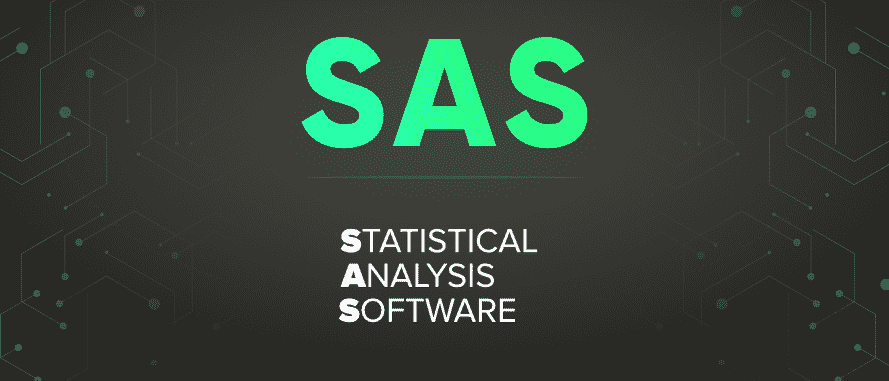

# SAS 完整表格

> 原文:[https://www.geeksforgeeks.org/sas-full-form/](https://www.geeksforgeeks.org/sas-full-form/)

**SAS** 代表**统计分析软件。**它是由 SAS Inc .为进展调查、多元检验、贸易洞察、信息管理和先见分析创建的软件产品的集成框架。

特种部队的发展始于 1966 年，一直持续到 1976 年，由安东尼·巴尔、詹姆斯·古德奈特、约翰·萨勒和简·特·海维格组成特种部队。在 20 世纪 80 年代和 90 年代，随着现代统计策略、额外组件和 JMP 的出现，SAS 变得更加先进。2004 年，点击式界面被纳入表格 9，2010 年，社交媒体分析项目被纳入表格 9。
SAS 可能是一个**强大的工具。**它可以阅读和获取任何种类的信息，也可以从任何种类的安排和软件中获取数据。通过利用 if-then 解释，您将在 SAS 中执行一致的操作。您将能够在 SAS 中一步一步地循环运行任何发音，并且程序执行异常迅速。

#### **SAS 的特性**

*   **扎实的信息分析能力–**
    第一个 SAS 包括的是 SAS 编程有扎实的信息考查能力。SAS 最好的部分是内置的库。这些包包含了分析和公布数据所需的所有重要包。
*   **SAS Studio–**
    它可以从任何设备和任何网络浏览器上有效地获得。不需要客户机构。SAS 程序的所有库和信息记录都可以通过任何网络浏览器获得。
*   **信息加密算法–**
    SAS 确保安全性与我们允许访问的方式无关。SAS/SECURE 是 SAS 9.4 中的一个安全亮点。我们也能够通过不同的算法加密磁盘上的 SAS 信息。
*   **支持各种类型的数据格式–**
    SAS 语言能够从任何类型的记录、任何排列甚至从丢失数据的记录中学习信息。
*   **管理–**
    SAS 环境主管提醒、筛选和监督分析环境。扩展的 Java 图形客户端界面在 SAS 管理控制台中管理 SAS 任务。

#### SAS 的优势

*   SAS 非常**简单，记住句子结构。**不需要任何编程专业知识就可以轻松学会，任何人都可以学会。

*   SAS 非常有能力轻松管理**大型数据库**。
*   SAS 可能是一种非常容易理解的语言。调试的方法异常简单。这很容易理解。
*   **SAS 的组织保持适当的检查，**因为它就像一个总的组织来分析 SAS。它有天然的客户支持。
*   对于众多规模庞大的公司来说，SAS 软件可能是必不可少的设备。公司的信息在这里是**机密**这就是为什么它可能是公司的近源。
*   统计输出的清晰性和一致性使用户能够轻松理解分析结果。
*   该软件是集成的，将帮助用户访问和管理数据。

#### SAS 的缺点

*   SAS 软件的**成本是其主要缺点之一。没有许可证，我们不能使用它的所有功能，这是非常昂贵的。**
*   高级图形还有**更多的 R 可访问性。**它的图形呈现比 SAS 要醒目可靠得多。它有一个更形象的图表。
*   与 R 相比，SAS 更像是**过程语言**。SAS 中的**代码行比 R 多。与 SAS 相比，我们可以在 R 中快速应用统计学习和机器学习等现代进步。**
*   SAS 是一个**封闭环境软件，**并且它不支持开源，所以 SAS 策略的计算不是为了公众使用。
*   **R 中的文本挖掘是免费的，**但是在 SAS 中，它使用的是 SAS 承诺书。文本挖掘意味着从内容中提取数据。这通常被用来解码书写的代码。
*   减少可用的图形功能数量。
*   瞬间学习非常**复杂。**