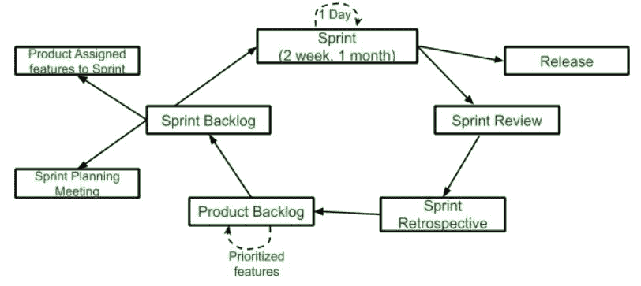

# Scrum(软件开发)

> 原文:[https://www.geeksforgeeks.org/scrum-software-development/](https://www.geeksforgeeks.org/scrum-software-development/)

**Scrum** 是**敏捷框架**的类型。这是一个框架，在这个框架内，人们可以解决复杂的适应性问题，同时交付产品的生产力和创造力达到最高可能的价值。Scrum 使用**迭代过程**。

**Scrum 的静默特性是:**

*   Scrum 是轻量级框架
*   Scrum 强调自组织
*   Scrum 很容易理解
*   Scrum 框架帮助团队一起工作

**Scrum 的生命周期:**

**冲刺:**
冲刺是一个月或者更短的时间。一个新的冲刺会在前一个冲刺完成后立即开始。

**发布:**
产品完成后进入发布阶段。

**冲刺评审:**
如果产品还有一些不可实现的功能，那么在这个阶段会进行检查，然后产品进入冲刺回顾阶段。

**冲刺回顾:**
在这个阶段检查产品的质量或状态。

**产品积压:**
根据优先特性组织产品。

**Sprint Backlog:**
Sprint Backlog 分为两部分产品分配特性给 Sprint 和 Sprint 计划会议。

**使用 Scrum 框架的优势:**

*   Scrum 框架移动速度快，资金效率高。
*   Scrum 框架通过将大的产品分成小的子产品来工作。这就像是分而治之的策略
*   在 Scrum 中，客户满意度非常重要。
*   Scrum 本质上是自适应的，因为它的冲刺时间很短。
*   由于 Scrum 框架依赖于持续的反馈，因此产品质量在更短的时间内提高

**使用 Scrum 框架的缺点:**

*   Scrum 框架不允许改变他们的冲刺。
*   Scrum 框架不是完全描述的模型。如果你想采用它，你需要在框架中填入你自己的细节，比如极限编程、看板、DSDM。
*   Scrum 很难计划、组织和组织一个缺乏清晰定义的项目。
*   每天的 Scrum 会议和频繁的评审需要大量的资源。