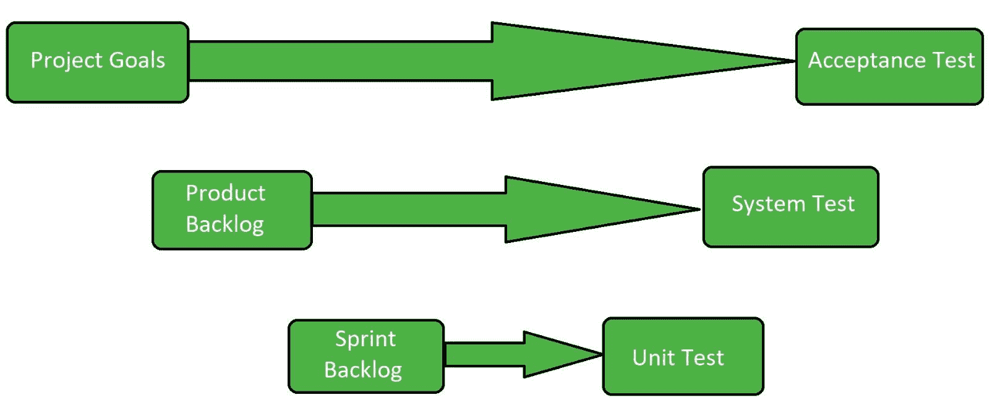
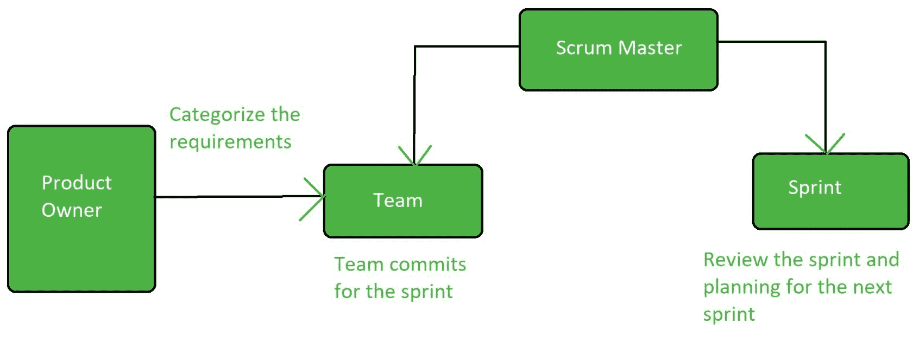

# Scrum 测试

> 原文:[https://www.geeksforgeeks.org/scrum-testing/](https://www.geeksforgeeks.org/scrum-testing/)

Scrum 测试是一种软件测试，用来检查软件或应用程序执行复杂过程的能力。该测试还检查软件的各种其他参数，如质量、可用性和性能。复杂过程的执行需要复杂的软件。因此，为了制作一个复杂的软件，scrum 测试是必需的。

**Scrum 测试的目标:**
Scrum 测试的目标是:

*   检查软件的复杂性。
*   测试软件的质量。
*   测试软件的性能。
*   测试软件的可用性。
*   支持单元测试。

**Scrum 测试的特点:**
以下是 Scrum 测试的特点:

*   Scrum 测试有一些连续重复的序列。
*   Scrum 测试的生命周期会在一段时间后过期。
*   Scrum 测试在每个周期都有固定的时间表。
*   基本上取决于一些关键小玩意的发展。

**Scrum 测试的关键属性:**

**项目目标:**
包括项目背后的基本思想和软件的需求。它主要关注软件是否满足基本要求。它包括所有的计划和需求分析阶段。它包含其他几个属性。

**产品积压:**
产品积压是针对 scrum 产品观察到的用户体验的集合。产品所有者准备并维护产品积压。它由产品所有者分类，任何人都可以在征得产品所有者同意的情况下添加它。

**Sprint Backlog:**
Sprint Backlog 是在一次冲刺中要完成的用户体验的集合。在冲刺积压期没有分配工作，团队自己报名参加工作。它由团队拥有和管理。剩余的预计工作量每天更新。它是要在 Sprint 中执行的任务的集合。

**Scrum 测试的优势:**
Scrum 测试的优势有:

*   它有助于确定软件的质量。
*   它有助于单元测试。
*   它有助于构建复杂的软件。