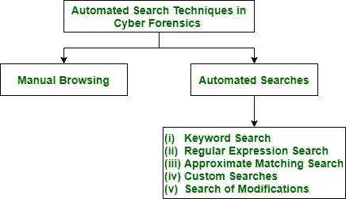

# 网络取证中的搜索技术

> 原文:[https://www . geesforgeks . org/search-technologies-in-cyber-forensics/](https://www.geeksforgeeks.org/search-techniques-in-cyber-forensics/)

[计算机取证](https://www.geeksforgeeks.org/introduction-of-computer-forensics/)检查使用计算机生成的数据作为其重要来源。任何给定的计算机法医检查的目标都是发现事实，并通过这些事实试图重现事件的真相。这些自动搜索技术用于发现特定类型的对象(如黑客工具或特定类型的图片)是否存在于收集的信息中。

有两种类型的自动搜索技术:手动浏览和自动浏览。

**Figure –** Types of automated search techniques in cyber forensics

**什么是手动浏览？**
法医分析师浏览已收集的信息，并在手动浏览中选择首选类型的对象。用于此浏览的工具是 Watcher 类型。它获取数据对象，例如文件，解码该文件，并以人类可读的格式返回结果。手动浏览速度慢且耗时，因为大量调查需要收集大量数据。

**什么是自动搜索？**
automate 这个词来自希腊语 automatos，意思是“自己行动”自动化的东西可以做它应该做的事情，而不需要人来帮助运行它。自动搜索程序提供对另一方的自动文件的直接访问，其中对搜索程序的响应是完全自动的。

自动搜索的类型有:关键词搜索、正则表达式搜索、近似匹配搜索、自定义搜索、修改搜索。

1.  **关键词搜索–**
    网络取证关键词搜索是用于从大量电子数据中寻找证据的功能。在网络犯罪调查过程中，取证电子邮件搜索是根据您在计算机取证工具中输入的关键字执行的。关键词搜索由特定的关键词组成。这是一种广泛使用的加速手动浏览的简单技术。找到的数据对象列表是关键字搜索的输出。然而，关键词搜索有两个问题:假阳性和假阴性。
    *   **(一)。假阳性:**
        关键词搜索给出了数据对象的大致所需类型。由于这种输出，这可能有假阳性。假阳性表示对象不属于任何特定类型，即使它们包含指定的关键字。法医分析师必须手动浏览关键字搜索数据对象以丢弃误报。
    *   **(二)。假阴性:**
        假阴性是指存在特定给定类型的对象，但被搜索遗漏。如果搜索工具无法正确解释数据对象，则结果为假阴性。加密、压缩或缺乏搜索工具解释新数据的能力可能是发生这种情况的原因。
2.  **正则表达式搜索–**
    正则表达式(Regex)是一种强大的方法，用于在基于文本的文件中搜索具有可识别模式的数据。这种搜索提供了比关键字更能表达的语言来描述感兴趣的对象。这是关键词搜索的扩展。这些也用于指定对电子邮件地址和精确类型文件的搜索。为了执行正则表达式搜索，使用了装箱工具。使用正则表达式并不能充分描述所有类型的数据。正则表达式搜索也会导致假阳性和假阴性。
3.  **近似匹配搜索–**
    正则表达式搜索的扩展是近似匹配搜索。它使用匹配算法。近似匹配搜索算法允许在搜索关键字时字符不匹配。它可以检测出拼写错误的单词，这些单词会导致不匹配并引发大量误报。agrep 用于近似匹配。
4.  **自定义搜索–**
    该工具使用启发式程序在收集的信息/数据中查找人员的全名。这些程序是为更复杂的搜索编写的，比如 new Technologies Inc .的 FILTER_1 工具，因为正则表达式的表达能力有限。这也受到假阳性和假阴性的困扰。
5.  **修改搜索–**
    这用于在过去的指定时刻已经被修改的数据对象。对数据对象的修改不像操作系统工具那样频繁。这些实用程序是通过将其当前哈希与预期哈希进行比较来检测的。搜索前会建立一个预期散列库。