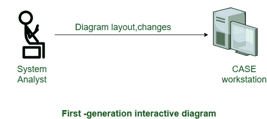

# 第二代 CASE 工具

> 原文:[https://www.geeksforgeeks.org/second-generation-case-tool/](https://www.geeksforgeeks.org/second-generation-case-tool/)

第二代 [CASE 工具](https://www.geeksforgeeks.org/computer-aided-software-engineering-case/)的一个重要特点是，任何量身定制的方法论的使命。这可能需要由案例管理员组织来执行，该组织可以根据特定的方法定制案例工具。此外，第二代 CASE 工具具有以下功能:

*   **智能图表支持:**
    模式化技术有助于系统分析和风格的事实已经得到很好的证实。长期的 CASE 工具将提供便利，以美观和机械的方式布局图表。
*   **与实现环境的集成:**
    CASE 工具应该给出风格和实现之间的集成。
*   **数据字典标准:**
    应该允许用户将多个开发工具集成到一个设置中。任何卖家都不可能准备好交付完整的解决方案。此外，最流行的工具需要针对选定的系统进行校准。因此，用户将充当系统求积仪。这可能是因为一些常见的知识词汇出现了。
*   **定制支持:**
    应该允许用户概述新的对象和连接种类。这个工具也习惯于构建一些特殊的方法。理想情况下，应该可以向规则引擎指定策略的原则，以完成所需的一致性检查。

下图显示了第二代 CASE 工具自动化的功能:

