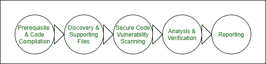

# 安全代码审查评估

> 原文:[https://www . geesforgeks . org/secure-code-review-assessment/](https://www.geeksforgeeks.org/secure-code-review-assessment/)

**什么是代码评审？**
开发健壮的企业级应用程序是一项耗时的任务，让它们完全安全是一项不可能完成的任务。事实上，安全不是要建立一个不可逾越的堡垒，而是要管理和减轻风险。代码审查旨在识别应用程序中与其特性和设计相关的安全缺陷，以及确切的根本原因。随着应用程序复杂性的增加和新技术的引入，传统的测试方法可能无法检测到应用程序中存在的所有安全缺陷。

理解应用程序代码、外部组件和配置非常重要，这样才能更好地发现安全漏洞。深入研究应用程序代码也有助于确定可用于避免安全漏洞的确切缓解技术。代码审查是确保应用程序在其环境中被开发为“自我防御”的一种方式，并允许组织确保应用程序开发人员遵循安全的开发技术。

最好将**代码评审评估**编织到 SDLC 流程中，这样组织就不会将安全性视为障碍，而是将其视为帮助，并使他们能够交付安全的产品。将安全编码扩展到整个组织允许安全的代码审查任务扩展到更多的开发团队。随着流程的增长，越来越多的开发人员了解安全编码机制，安全编码漏洞的出现频率也会下降。

**代码审查与安全代码审查有何不同？**
代码评审被认为是一种软件质量保证活动，其中分析师检查代码中与功能或业务需求相关的缺陷。通常通过同行评审或质量保证团队来完成。

**安全代码审查**是对标准代码审查实践和方法的增强，其中审查流程的结构将安全考虑(如公司安全标准)置于决策的最前沿。评估由网络安全团队进行。

应用程序的安全审查应该揭示常见的安全漏洞以及应用程序业务逻辑特有的问题。为了有效地评审代码，评审者理解应用程序的业务目的和关键业务影响是很重要的。审稿人要了解攻击面；确定不同的威胁代理及其动机，以及它们可能如何攻击应用程序。

**如何进行安全代码审查？**
安全代码审查通过两种方式完成:

*   **手动代码审查–**
    审查人员需要通过完整的代码和了解工作流程来识别漏洞。定义一个通用的清单是一个很好的晴雨表，可以用来衡量开发人员已经尝试或想到的安全级别。通常集成开发环境用于手动审查，因为它使代码更容易阅读。
*   **自动化代码审查–**
    审查人员需要审查 SAST 工具生成的报告，并将报告的漏洞识别为假阳性或真阳性。一些流行的工具有:Fortify、Checkmarx、IBM AppScan 源码、Bandit 等。