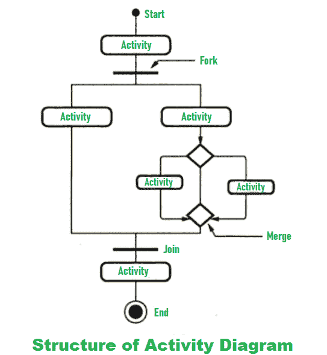
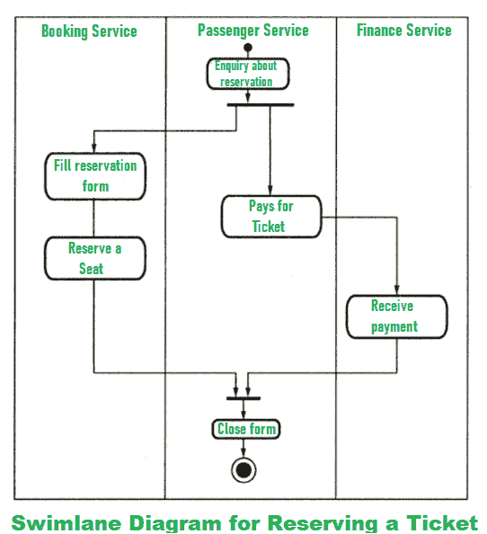

# 活动和泳道示意图的简短说明

> 原文:[https://www . geeksforgeeks . org/活动和泳道示意图短记/](https://www.geeksforgeeks.org/short-note-on-activity-and-swimlane-diagram/)

活动图中的活动也称为活动状态。它用于表示操作的调用，这是整个业务流程中的一个步骤。泳道是一种方式，通过这种方式，执行的活动可以由活动图中的同一参与者分组。要在活动图中使用泳道，我们需要将活动图排列成由线条分隔的垂直区域。此泳道图使用池中泳道的比喻，将流程步骤放置在工作组或部门的水平或垂直泳道中。它提供了清晰度和问责制。

活动图是一种特定的[统一建模语言(UML)](https://www.geeksforgeeks.org/unified-modeling-language-uml-introduction/) 图，它可以选择性地包含泳道，这意味着活动图不一定必须包含泳道。因此，我们可以说活动图可以是泳道图。另一方面，泳道不是术语 UML 的一部分。

让我们用一个例子来理解活动和泳道图。

1.  **活动图–**
    它是统一建模语言(UML)中必不可少的图，也被称为面向对象流程图。它简单地描述了一个系统的积极的和富有成效的特征或部分。它基本上用于以图形表示的形式表示从一个活动到另一个活动的交互流。它被描述为系统的一种操作，也用于捕捉系统的动态行为。这里，活动被称为系统的操作。

    它允许我们将一个事件作为一个活动来创建和制作，该活动通常包含许多由边连接的节点集合。这些图通常用于建模用例、类、接口、组件、协作等。为了理解这个图表，我们需要从上到下阅读它。使用活动图，我们可以直观地表示工作流。

**活动图的结构:**

例如，下面是预订机票的活动图。

*   **Swimlane Diagram :**
    It is also a graphical representation of the System. Swimlane diagrams are also known as the Rummler-Brache diagram or a cross-functional diagram. Swimlanes are sometimes called functional bands. It simply describes who is responsible for the activities being performed in the activity diagram and how they are responsible. The activity diagram only represents the activities being performed, but Swimlane describes who does what in a process or activity performed.

    In the Swimlane diagram, the activity diagram is divided according to the class responsible for working or performing out these activities. It simply shows the connection and strong communication between these lanes and is used to highlight waste, redundancy, and inefficiency in a process of an activity or program.

    例如，下面是预订机票的泳道图。

    

    **以上各图的要点:**

    *   **Fork–**
        用来表示多个平行流。
    *   **分支–**
        它允许活动中的平行流动。
    *   **合并–**
        它将多个分支集合在一起或组合在一起。
    *   **Join–**
        用于控制和同步各种并行流。