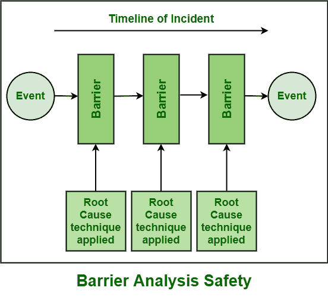

# 障碍分析的简短说明

> 原文:[https://www . geesforgeks . org/short-note-on-barrier-analysis/](https://www.geeksforgeeks.org/short-note-on-barrier-analysis/)

[根本原因分析(RCA)](https://www.geeksforgeeks.org/basic-principle-of-root-cause-analysis/) 是一种用于识别问题根本原因的系统方法。屏障分析是确定和识别危险影响所需的一种 RCA 技术。这是一个有效的工具，通过屏障为目标提供安全。

它是为组织或系统的目标提供保护的安全工具。它通过设置屏障来控制危险，只是为了防止失败或问题。在屏障分析中，识别危害、目标和途径，危害通过这些途径影响目标。

然后用屏障和控制来保护和维持特定条件下的目标。执行障碍分析时，脑海中出现的一些问题如下–

*   如何识别可能影响目标的危险能源？
*   危险影响目标的能量路径是什么？
*   需要保护哪些目标免受危害？
*   危险和目标之间存在哪些安全屏障？
*   如何确定这样的安全屏障？

**障碍类型:**
在障碍分析中，可能存在以下类型的障碍–

*   阻止能源生产。
*   为了防止释放。
*   给目标提供加强。
*   减少造成损害的影响。

如果有害效应或有害能量与目标之间没有屏障，则导致软件质量下降，并对目标产生负面影响，而如果危害与目标之间存在屏障，则目标是安全的，不会受到危害。

**障碍分析工作表:**
障碍分析通常使用工作表或任何其他不同的形式进行，只是为了提供文档、结构等。数据以特定的格式呈现，因为数据也是一个重要的东西，需要为将来的分析进行维护。以下是工作表中应包含的一些信息或数据–

*   系统中存在的一些危险和有害影响。
*   目标可以是任何人、产品、过程等。并且需要被保护免受危害。
*   需要放置在目标和屏障之间的屏障，以防止目标受到有害影响。
*   已经放置在目标和屏障之间的屏障，用于控制能源，只是为了防止目标。
*   总体确定的风险。

**需要记住的要点:**
在执行障碍分析时，需要考虑几个要点来减少问题，如下所示–

*   人们应该设法确定系统中可能存在的全部能源。
*   还应评估和分析级联结果，即有害和负面的能量来源。
*   一个人应该理解和了解所有的能源途径，通过这些途径，危险会影响目标。
*   应该分析和考虑整个系统，而不仅仅是能量路径。