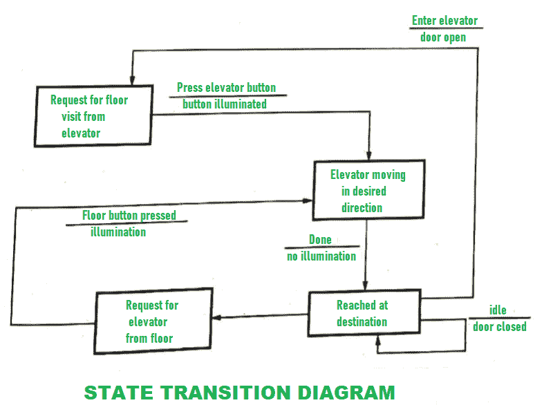

# 行为模型简介

> 原文:[https://www . geesforgeks . org/行为模型短评/](https://www.geeksforgeeks.org/short-note-on-behavioral-model/)

行为模型可以完全理解系统的整体行为。

**行为模型**是专门为了让我们了解一个系统的行为以及影响行为的因素而设计的。借助图表来解释和表示系统的行为。这个图被称为状态转移图。它是状态和事件的集合。它通常描述系统可能具有的总体状态以及导致系统状态变化的事件。

因此，在某个特定事件发生时，会采取一个操作，需要采取的操作由状态转换图表示。

**例如:**
考虑一部电梯。这部电梯有 n 层，每层有 n 个按钮。
电梯的工作可以解释如下:

1.  **电梯按钮**是电梯上的一组按钮类型。为了到达您想要访问的特定楼层，该特定楼层的“电梯按钮”被按下。按下，将产生照明，电梯将开始向您按下“电梯按钮”的特定楼层移动。一旦电梯到达那个特定的楼层，
    照明就会被取消。
2.  **楼层按钮**是电梯上的另一类按钮组。如果一个人在一个特定的楼层，他想去另一个楼层，那么该楼层的电梯按钮被按下。然后，过程将与上面给出的相同。按下，将导致照明和电梯开始移动，当它到达所需楼层时，照明被取消。
3.  当没有电梯要求时，电梯在当前楼层保持关闭。

电梯系统的状态转换图如下所示–

**优势:**

*   一个系统的行为和工作无需任何努力就可以很容易理解。
*   使用该模型，结果更加准确。
*   这种模式需要较少的开发成本，因为资源成本可以最小化。
*   它关注的是系统的行为，而不是理论。

**缺点:**

*   这个模型没有任何理论，所以学员不能够完全理解建模的基本原理和主要概念。
*   这种建模不能完全自动化。
*   有时候，不容易理解整体结果。
*   由于某些技术问题或任何错误，无法实现最高生产率。