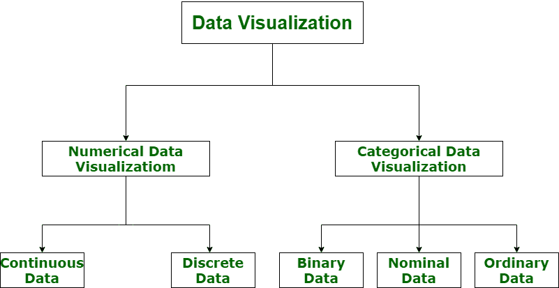

# 数据可视化的简短说明

> 原文:[https://www . geesforgeks . org/data-visualization 上的简短注释/](https://www.geeksforgeeks.org/short-note-on-data-visualization/)

**数据可视化**实际上是一组数据点和信息，通过图形化的方式表示，让用户理解起来简单快捷。数据可视化是好的，如果它有明确的含义、目的，并且非常容易解释，不需要上下文。数据可视化工具通过使用图表、图形和地图等视觉效果或元素，为查看和理解数据中的趋势、异常值和模式提供了一种可访问的方式。

**有效图形视觉的特征:**

*   它以可理解的方式非常清晰地显示或可视化数据。
*   它鼓励观众比较不同的数据。
*   它紧密结合了数据集的统计和语言描述。
*   它抓住了我们的兴趣，集中了我们的思想，并让我们的眼睛盯着信息，因为人脑更倾向于关注视觉数据，而不是书面数据。
*   它还有助于确定需要更多关注和改进的领域。
*   使用图形表示，可以更有效地讲述一个故事。此外，理解图片比理解文本数据需要更少的时间。

**数据可视化的类别；**
数据可视化对市场研究至关重要，在市场研究中，数字和分类数据都可以可视化，这有助于增加见解的影响，也有助于降低分析瘫痪的风险。因此，数据可视化分为以下几类:

**Figure –** Categories of Data Visualization

1.  **Numerical Data :**
    Numerical data is also known as Quantitative data. Numerical data is any data where data generally represents amount such as height, weight, age of a person, etc. Numerical data visualization is easiest way to visualize data. It is generally used for helping others to digest large data sets and raw numbers in a way that makes it easier to interpret into action. Numerical data is categorized into two categories :
    *   **连续数据–**
        可以缩小或分类(例如:身高测量)。
    *   **离散数据–**
        这种类型的数据不是“连续的”(例如:一个家庭拥有的汽车或儿童数量)。

    用于表示数字数据可视化的可视化技术类型是图表和数值。例如饼图、条形图、平均值、记分卡等。

2.  **Categorical Data :**
    Categorical data is also known as Qualitative data. Categorical data is any data where data generally represents groups. It simply consists of categorical variables that are used to represent characteristics such as a person’s ranking, a person’s gender, etc. Categorical data visualization is all about depicting key themes, establishing connections, and lending context. Categorical data is classified into three categories :
    *   **二进制数据–**
        在这种情况下，分类是基于定位的(例如:同意或不同意)。
    *   **名义数据–**
        在这种情况下，分类基于属性(例如:男性或女性)。
    *   **序数数据–**
        在这种情况下，分类基于信息的排序(例如:时间线或流程)。

    用于表示分类数据的可视化技术类型是图形、图表和流程图。例如词云、情感映射、文氏图等。