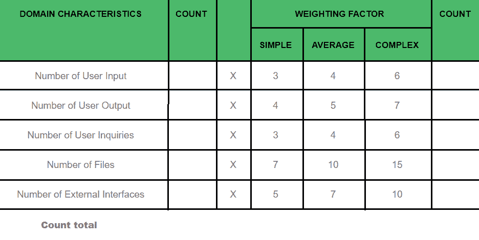
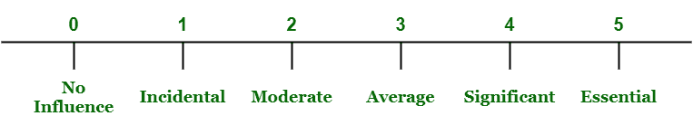

# 面向功能的度量标准的简短说明

> 原文:[https://www . geeksforgeeks . org/面向功能的简短说明-度量/](https://www.geeksforgeeks.org/short-note-on-function-oriented-metrics/)

先决条件–[功能点分析](https://www.geeksforgeeks.org/software-engineering-functional-point-fp-analysis/)、[功能点计算](https://www.geeksforgeeks.org/software-engineering-calculation-of-function-point-fp/)

**面向功能的度量**是 Albrecht 在 1979 年为 IBM(国际商用机器公司)开发的一种方法。他只是建议了一种称为功能点的度量，这种度量是使用经验关系导出的，这种经验关系基于软件信息或需求领域的可计数度量和软件复杂性的评估。

面向功能的度量也称为**功能点模型**。这种模型通常关注被交付的软件应用程序的功能。这些方法实际上独立于软件应用程序中使用的编程语言，并且基于计算功能点。功能点是衡量业务产品提供的业务功能的度量单位。

要确定一个特定条目是简单的、容易的、一般的还是复杂的，需要一个标准，并且应该由组织制定。在观察或实验的帮助下，应确定不同的称重系数，如下表所示。在这些表的帮助下，可以计算出计数表。



软件复杂性可以通过回答以下问题来计算:

*   系统是否需要可靠的备份和恢复？
*   需要数据通信吗？
*   有分布式处理功能吗？
*   系统的性能至关重要吗？
*   系统能否在现有的、大量使用的操作环境中运行？
*   系统是否需要在线数据输入？
*   在线数据输入是否需要通过多个屏幕或操作来构建输入事务？
*   主文件是否在线更新？
*   输入、输出、文件或查询是否复杂？
*   内部处理复杂吗？
*   设计的代码是可重用的吗？
*   设计中包括转换和安装吗？
*   该系统是否根据需要为不同组织中的多个安装而设计？
*   应用程序是否旨在促进或进行更改，并为用户提供有效的易用性？

以上每个问题都用 0 到 5 的范围回答(不重要或适用于绝对必要)。
该刻度如下图所示:



**计算功能点:**


计算功能点后，可以计算各种其他度量，如下所示:

```
Productivity =  FP / person-month
Quality = Number of faults / FP
Cost = $ / FP
Documentation = Pages of documentation / FP 
```

**一些数字–**

<center>

| 语言 | 每个功能点的代码行 |
| ADA 83 | Seventy-one |
| C | One hundred and twenty-eight |
| C++ | forty-nine |
| CLOS | Twenty-seven |
| COBOL 85 | Ninety-one |
| 埃菲尔 | Twenty-one |
| C++
小谈 | 21
21 |
| visualbasic 语言 | Thirty-two |

</center>

```
Small Project: <2000 Function Points 
Medium Project: 2, 000 to 10, 000 Function Points 
Large Project: > 10, 000 Function Points 
```

**面向功能的度量的缺点:**

*   面向功能的度量只为业务系统开发，因此它只对该领域有效。
*   在这方面，有些方面是主观的，没有得到验证。
*   功能点没有任何物理意义。这只是一个数字。