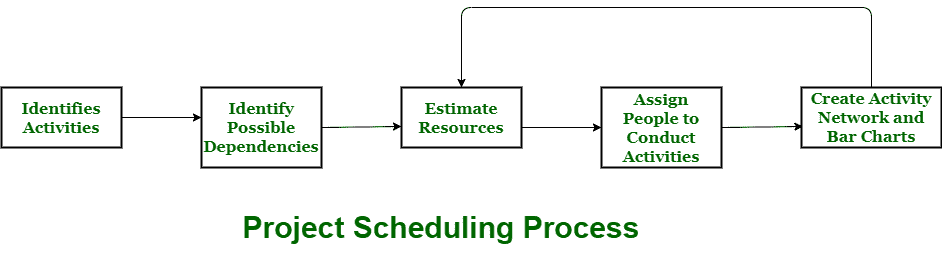

# 项目进度短记

> 原文:[https://www . geesforgeks . org/project-scheduling 短讯/](https://www.geeksforgeeks.org/short-note-on-project-scheduling/)

项目时间表中的时间表实际上由给定时间内需要交付的有序活动和里程碑组成。

**项目时间表**简单来说就是一种机制，用于沟通和了解需要完成或必须执行的任务，哪些组织资源将被给予或分配给这些任务，以及需要在什么时间段或时间框架内执行工作。有效的项目进度安排会导致项目的成功、成本的降低和客户满意度的提高。项目管理中的时间安排意味着列出项目中已交付的活动、可交付成果和里程碑。它包含的笔记比一般的每周计划笔记要多。项目进度最常见和最重要的形式是甘特图。

**流程:**
经理在安排项目时需要预估项目的时间和资源。项目中的所有活动必须以连贯的顺序进行安排，这意味着活动应该以逻辑和组织良好的方式进行安排，以便于理解。可以乐观地对项目进行初步评估，这意味着可以在所有有利的事情都将发生并且没有威胁或问题发生时进行评估。

在项目进度期间，总工作被分离或分成各种小活动或任务。然后，项目经理将决定完成每项活动或任务所需的时间。甚至有些活动是并行进行的，以提高效率。项目经理应该意识到项目的每个阶段都不是没有问题的。

**项目开发阶段出现问题:**

*   在特定的发展阶段，人们可能会离开或继续缺席。
*   执行时，硬件可能会出现故障。
*   所需的软件资源目前可能不可用，等等。

项目进度被表示为一组图表，其中工作分解结构和各种活动中的依赖关系被表示出来。为了在给定的时间表内完成项目，必要的资源必须在需要时可用。因此，在开始开发之前，应该进行资源估算。

**项目开发所需资源:**

*   人类的努力
*   服务器上有足够的磁盘空间
*   专用硬件
*   软件技术
*   项目工作人员所需的差旅津贴等。

**项目进度的优势:**
在我们的项目管理中，项目进度提供了几个优势:

*   它只是确保每个人都在同一个页面上，直到任务完成、依赖关系和截止日期。
*   它有助于及早发现问题和关注点，如资源缺乏或不可用。
*   它还有助于识别关系和监控过程。
*   它提供有效的预算管理和风险缓解。