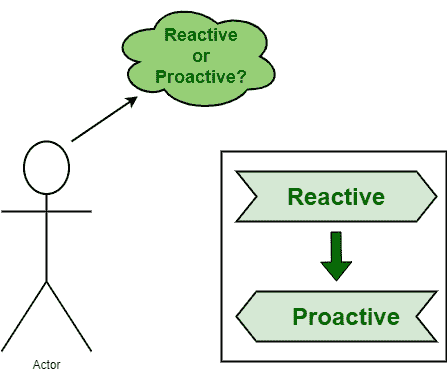

# 关于反应性和主动性 RCA 的简短说明

> 原文:[https://www . geeksforgeeks . org/关于反应性和主动性 rca 的简短说明/](https://www.geeksforgeeks.org/short-note-on-reactive-and-proactive-rca/)

[根本原因分析(RCA)](https://www.geeksforgeeks.org/basic-principle-of-root-cause-analysis/) 是以非常系统的方式或过程识别问题或事件的主要原因或根本原因的最佳方法之一。RCA 的理念是，为了有效的管理，我们需要找到方法来防止出现或发生问题。

每个人都需要明白，如果他们想解决或消除任何问题，至关重要的是找到问题的根源，然后消除问题，这样他们就可以减少或控制问题的再次发生。对于想要持续改进和发展的组织来说，找到根本原因是非常必要的。虽然很难做到，但这是必不可少的。RCA 还可以用来修改或改变核心流程和问题，以防止未来出现问题。

**被动和主动 RCA :**
出现的主要问题是 RCA 是被动还是主动？有人认为 RCA 只需要解决已经发生的问题或故障。但是，这不是真的。人们应该知道，RCA 可以是被动的，也可以是主动的，如下所示–

**1。反应性 RCA :**
反应性 RCA 中出现的主要问题是“出了什么问题？”。在调查或确定故障或缺陷的根本原因之前，故障需要到位或应该已经发生。只有在出现导致系统故障的问题或故障时，才能确定根本原因并进行分析。反应性 RCA 是在故障或缺陷发生后进行的根本原因分析。

这只是为了控制，为了减少已经发生的缺陷的影响和严重性。它也被称为反应性风险管理。只要一出现问题，它就会通过简单地治疗症状迅速做出反应。驻地协调员评估通常是被动的，但也有可能是主动的。RCA 在初始阶段是被动的，只有当一个人解决并识别出可能导致问题的小事情以及暴露问题的隐藏原因时，它才能是主动的。

**优势:**

*   帮助一个人根据任务的严重程度确定其优先级，然后解决它。
*   增加团队合作和他们的知识。

**缺点:**

*   有时，在故障后解决设备可能比防止故障发生成本更高。
*   故障设备会对系统造成更大的损害，并中断生产活动。

**2。主动 RCA :**
主动 RCA 中出现的主要问题是“会出什么问题？”。RCA 还可以主动用于减轻故障或风险。RCA 应用于尚未发生的事件，可以看出它的主要重要性。主动 RCA 是在任何故障或缺陷发生之前进行的根本原因分析。这只是为了控制，为了防止缺陷的发生。由于被动和主动的驻地协调员评估都很重要，人们应该从被动转向主动的驻地协调员评估。

最好是防止问题发生，而不是在问题发生后进行纠正。简单来说，预防胜于纠正。在这里，预防措施被认为是主动的，纠正措施被认为是被动的。它也被称为主动风险管理。它识别问题的根本原因，以避免问题再次发生。借助主动的 RCA，我们可以识别导致问题或故障或缺陷发生的主要根本原因。知道这一点后，我们可以采取各种措施和实施行动来防止这些原因的发生。

**优势:**

*   未来发生故障的机会可以最小化。
*   通过简单地防止故障发生，降低解决故障所需的总成本。
*   通过最大限度地减少因故障而中断的机会来提高整体生产率。

**缺点:**

*   有时，防止设备故障比在故障发生后解决故障的成本更高。
*   防止可能影响总成本的故障发生所需的许多资源和工具。
*   需要高技能的技术人员来执行维护任务。