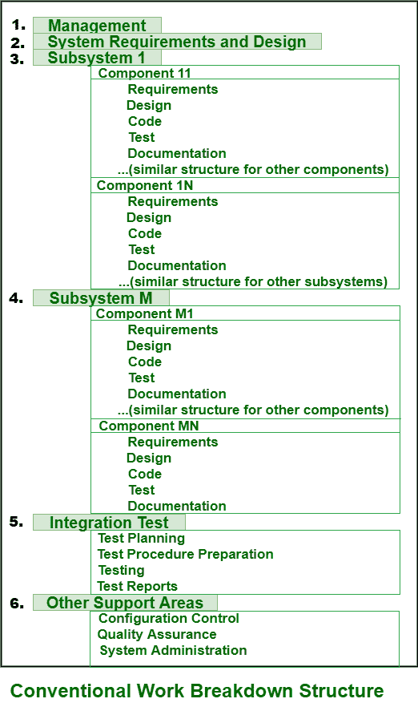

# 工作分解结构的简短说明

> 原文:[https://www . geeksforgeeks . org/工作短记-分解-结构-wbs/](https://www.geeksforgeeks.org/short-note-on-work-breakdown-structure-wbs/)

[工作分解结构(WBS)](https://www.geeksforgeeks.org/software-engineering-work-breakdown-structure/) 实际上是一种工具或关键的项目可交付成果，它将团队的工作组织成更简单、更易管理的部分或任务。这些只是项目团队需要执行的工作的可交付层次分解。

项目团队通常简单地通过识别最重要的功能可交付成果，并将所有这些变量细分为更小的系统和子可交付成果来创建工作分解结构。WBS 开发通常基于并依赖于项目管理风格、组织文化、客户偏好、财务约束以及其他各种特定于项目且难以定义的参数。在工作分解结构中，较大的任务被划分并分解成可管理的工作块。通常有两种类型的工作分解结构，即基于可交付成果的方法和基于阶段的方法。它只是提供各种信息结构。下面给出了其中一些信息结构:

*   简单明了的任务分解，用于分配各种职责
*   计划、预算和支出跟踪的基本支持结构
*   所有重要工作的描述

**常规的 WBS 问题:**
常规的工作分解结构通常过早地分解或结构化，计划和预算中围绕产品设计的细节描述太少或太多。传统的 WBS 通常有三个主要缺陷:

1.  **围绕产品设计的过早结构化或分解–**
    在下面给出的图表中，您将看到传统的 WBS 首先被分解或主要结构化为其所有产品架构的子系统。然后，它们被进一步分解成每个子系统的组件。在这一切之后，坚实的、强大的、现实的和必要的规划基础通常被设置，这是非常困难和非常昂贵的交换。
2.  **过早分解、计划和预算要么太少要么太多更详细的描述–**
    在上图中，所示的 WBS 对于大规模系统来说非常简单和容易。在这些情况下，通常会有六个或更多级别的 WBS。然而，在小规模或内部开发中，即使没有支持细节，WBS 也仅被细化到单一级别。但总的来说，WBS 只是简单地阐述和解释到至少两三个层面。可以说，大规模的开发一般都是过度规划，小规模的开发一般都是规划不足。
3.  **特定项目和跨项目的困难或不可能比较–**
    一些组织被简单地允许和给予许可，根据项目经理的风格、客户的需求或要求等来阐述他们的项目结构。如果没有 WBS 结构，比较计划、财务数据、进度数据、组织数据等等很多东西都会非常困难和辛苦。

**进化工作分解结构:**
进化工作分解结构只是围绕过程框架而不是产品框架来组织所有的计划元素。工作分解结构应以下列方式组织层次结构:

*   像工作流这样的元素，包括管理、环境、需求、设计、实现、评估和部署，应该在一级 WBS 中描述。
*   不同生命周期级别的元素，如初始、精化、构建和转换，应该在第二级 WBS 中定义。
*   开发不同阶段工件的活动的元素应该在第三级 WBS 中定义。

工作分解结构简单地构建项目的特征，并将其映射到生命周期、预算和人员。在要素之间分配的 WBS 和相对预算只是给出了对管理方法、优先级和关注点有意义的基本指标。使用 WBS，设计、组织和管理项目非常容易。这也有助于估计必要的资源，如成本、时间、人员等。提高项目效率。