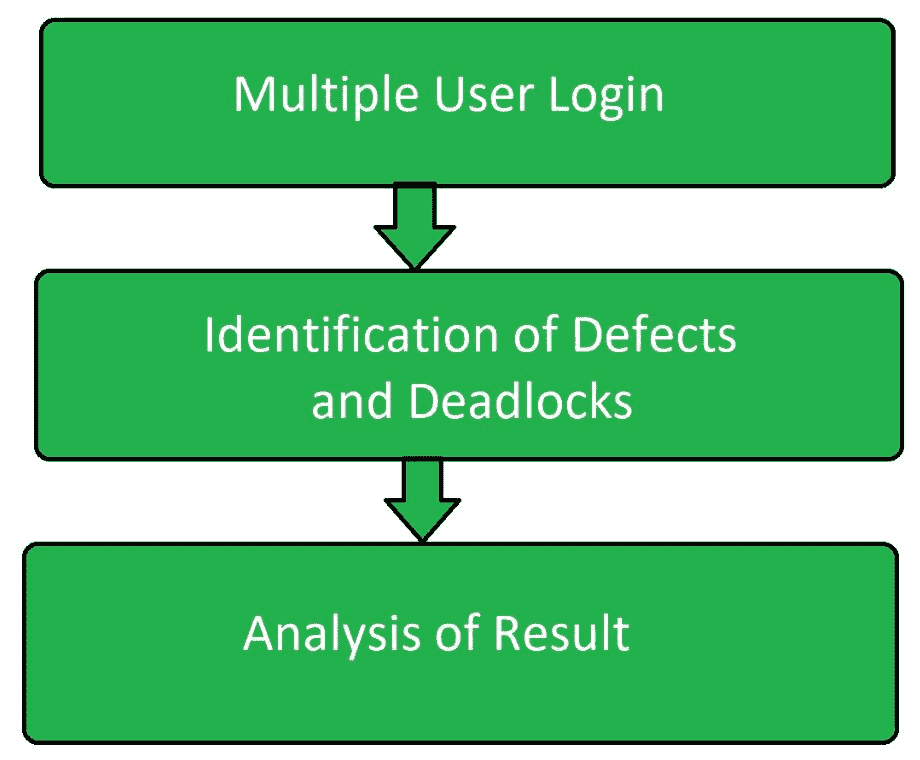

# 同步软件测试

> 原文:[https://www . geesforgeks . org/同声软件测试/](https://www.geeksforgeeks.org/simultaneous-software-testing/)

**同时测试**是[软件测试](https://www.geeksforgeeks.org/software-testing-basics/)的一种类型，基本上专注于测试使用同时计算的软件、系统和应用。像其他软件测试技术一样，同时测试的主要目的是发现使用同时计算的软件、系统和应用程序的行为和性能。

同步测试是一种测试类型，当多个用户登录到各自的应用程序时，执行该测试以识别软件、系统和应用程序中的缺陷。它有助于识别和测量系统参数中的问题，例如响应时间、吞吐量、死锁发生或任何其他同时相关的问题。在同时测试中，当多个用户同时执行相同的操作时，效果会受到监控。

同时测试也叫*多用户测试*。

**同时测试的目标:**
同时测试的目标是:

*   识别多用户同时访问应用程序中相同代码的效果。
*   当多个用户登录时，检测软件系统或应用程序中的缺陷。
*   提高并发编程的可靠性。
*   提高并发编程的健壮性。

**同时测试技术:**
以下是用于同时测试的不同技术:

*   **单次测试执行:**
    这被认为不是并发测试的有效技术。特别是在非确定性系统中，这种技术是无效的，就像测试非并发程序一样。
*   **多次测试执行:**
    它被认为能有效地发现非确定性系统中的缺陷。
*   **确定性技术:**
    该技术用于在特殊状态下测试系统，以便代码可以轻松执行。它不同于上述两种技术。
*   **可达性技术:**
    该技术用于测试指定输入的同步序列组合，基本上用于非确定性系统。
*   **结构化技术:**
    这是一种用于代码分析的结构化技术，与上面提到的技术不同。
*   **多用户技术:**
    该技术用于通过检查同时服务不同或相同任务的多个用户登录来测试并发程序。

**同时测试的优势:**

*   它减少了测试软件系统或应用程序所需的工作量。
*   它有助于发现程序的行为。
*   它有助于提高并发程序的可靠性。
*   它有助于提高并发程序的健壮性。

**同时测试的缺点:**

*   同步测试需要更密集的测试。
*   在同步测试中，方法不会立即返回结果值，这使得测试变得困难。
*   在同步测试中，需要多个平台。