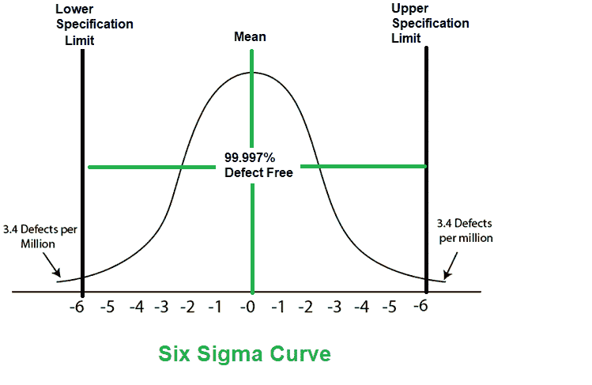
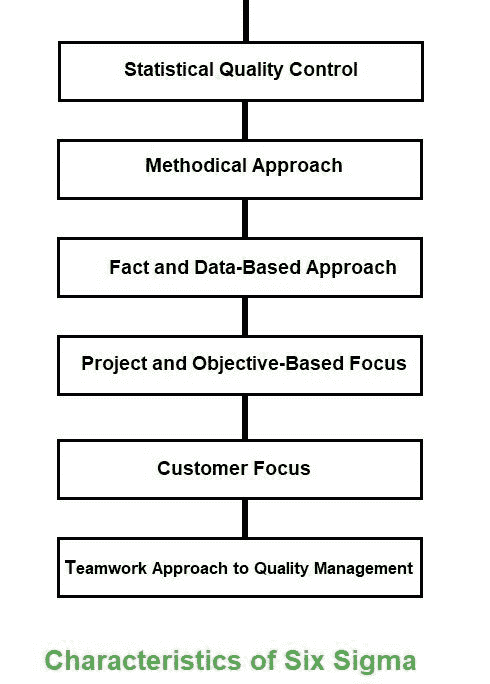

# 软件工程六适马

> 原文:[https://www . geesforgeks . org/六西格玛软件工程/](https://www.geeksforgeeks.org/six-sigma-in-software-engineering/)

**六适马**是生产高质量和改良产量的过程。这可以分两个阶段完成——识别和消除。确定缺陷的原因，并进行适当的消除，以减少整个过程中的变化。六西格玛方法是指 99.99966%的待生产产品具有相同的特征并且没有缺陷。

**六适马的特点:**
六适马的特点如下:

1.  **统计质量控制:**
    六适马来源于希腊字母？表示统计中的标准偏差。标准偏差用于测量输出质量。
2.  **系统方法:**
    六适马是在 DMAIC 和 DMADV 应用的系统方法，可用于提高生产质量。设计-测量-分析-改进-控制的 DMAIC 方法。而 DMADV 代表设计-测量-分析-设计-验证。
3.  **Fact and Data-Based Approach:**
    The statistical and methodical method shows the scientific basis of the technique.

    

4.  **项目和基于目标的聚焦:**
    实施六适马流程，聚焦要求和条件。
5.  **客户焦点:**
    客户焦点是六适马方法的基础。质量改进和控制标准基于特定的客户要求。
6.  **团队合作的质量管理方法:**
    六适马流程要求组织为了提高质量而组织起来。

**六个适马方法:**
六个适马项目中使用的两个方法是 DMAIC 和 DMADV。

*   **DMAIC** 用于增强现有的业务流程。DMAIC 项目方法有五个阶段:
    1.  规定
    2.  措施
    3.  分析
    4.  改善
    5.  控制
*   **DMADV** 用于创造新产品设计或工艺设计。DMADV 项目方法也有五个阶段:
    1.  规定
    2.  措施
    3.  分析
    4.  设计
    5.  核实