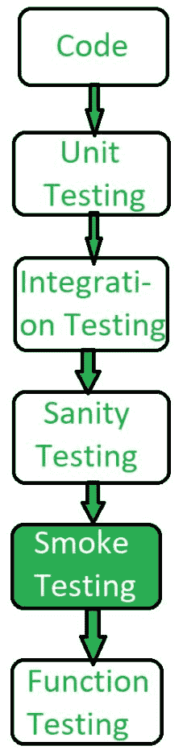

# 冒烟测试|软件测试

> 原文:[https://www . geesforgeks . org/smoke-testing-software-testing/](https://www.geeksforgeeks.org/smoke-testing-software-testing/)

先决条件–[软件测试类型](https://www.geeksforgeeks.org/types-software-testing/)
**冒烟测试**是一种软件测试方法，用于确定所采用的构建是否稳定。它确认质量保证团队是否可以继续进行进一步的测试。冒烟测试是在每个构建上运行的最小测试集。

冒烟测试是一个过程，其中软件构建被部署到质量保证环境，并被验证以确保应用程序的稳定性。烟雾测试也称为*或 ***构建验证测试*** 。*

*换句话说，我们验证重要的特性是否工作正常，并且在测试中的构建中没有任何亮点。
是主要功能的迷你快速回归测试。烟雾测试表明产品已准备好进行测试。这有助于确定构建是否有缺陷，从而使任何进一步的测试都浪费时间和资源。*

**

***烟雾测试的特点:**
以下是烟雾测试的特点:*

*   *烟雾测试有记录。*
*   *烟雾测试可能稳定，也可能不稳定。*
*   *烟雾测试是照本宣科的。*
*   *烟雾测试是回归测试的一种。*

*烟雾测试通常由质量保证工程师进行。*

***烟雾测试的目标:**
烟雾测试的目的是:*

1.  *检测软件产品中的任何早期缺陷。*
2.  *来证明系统的稳定性。*
3.  *证明符合要求。*
4.  *确保程序的重要功能正常工作。*
5.  *通过执行测试来测量软件产品的稳定性。*
6.  *测试软件产品的所有功能。*

***烟雾测试类型:**
烟雾测试有 2 种类型:**手动**，以及**自动化**。*

***烟雾测试的优势:***

1.  *烟雾测试很容易进行。*
2.  *它有助于在早期阶段识别缺陷。*
3.  *它提高了系统的质量。*
4.  *烟雾测试降低了失败的风险。*
5.  *烟雾测试使进展更容易获得。*
6.  *它节省了测试工作和时间。*
7.  *它使检测关键错误变得容易，并有助于纠正错误。*
8.  *它跑得很快。*
9.  *它将集成风险降至最低。*