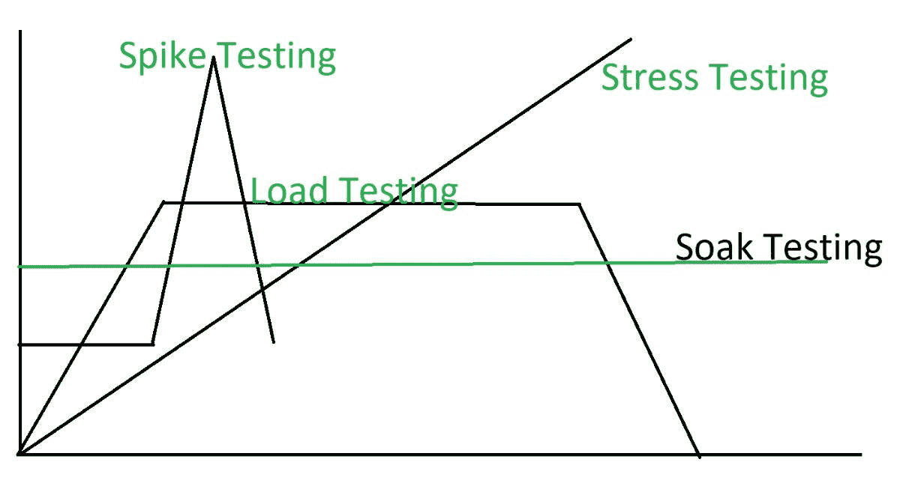

# 浸泡测试

> 原文:[https://www.geeksforgeeks.org/soak-testing/](https://www.geeksforgeeks.org/soak-testing/)

**浸泡测试**是一种软件测试类型，在这种测试中，系统在连续的可用性周期内在巨大的负载下进行测试，以检查系统在生产使用中的行为。
浸泡测试测试系统可以长时间承受巨大的负载量。

该测试在系统级执行，以发现系统是否经得起大量使用。它还测试在系统设计预期之外会发生什么。

**浸泡测试的目的:**
浸泡测试的目的是:

*   长时间在重载下检查系统行为。
*   预测由重载引起的故障。
*   测试系统的性能。
*   使系统可靠稳定。

**浸泡测试检测到的故障:**
浸泡测试检测到的故障或问题有:

*   **内存泄漏:**
    浸泡测试检测到可能导致应用程序崩溃或导致操作系统崩溃的严重内存泄漏。
*   **层连接故障:**
    浸泡测试发现系统各层之间的紧密连接故障，可能会中断系统的模块。
*   **数据库连接失败:**
    浸泡测试检测在某些可能导致整个系统崩溃的情况下关闭数据库连接的失败。
*   **响应时间下降:**
    浸泡测试发现，随着系统效率降低，响应时间延长，系统的响应时间下降。

**浸泡测试图形表示:**

**浸泡测试的优势:**
浸泡测试的优势有:

*   浸泡测试提高了系统的性能。
*   浸泡测试增加了系统的电阻。
*   浸泡测试使系统在重载下工作。
*   它改善了系统在长时间重载下的行为。