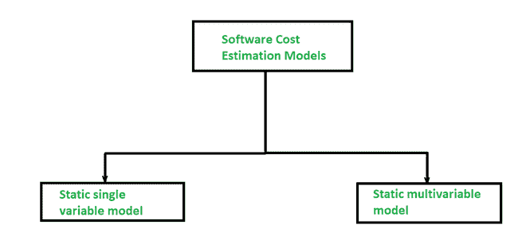

# 软件规划中的软件成本估算模型

> 原文:[https://www . geesforgeks . org/software-cost-estimation-models-in-software-planning/](https://www.geeksforgeeks.org/software-cost-estimation-models-in-software-planning/)

在开始一个新的**软件项目**时，知道开发需要花费多少成本，完成需要多少开发时间是很重要的。在开发开始并传达给团队之前，需要进行这些评估。软件行业对度量或原子度量单位的定义和解释不一致，从一致性和可比性来看，来自真实和实际项目的数据在很大程度上是高度可疑的。软件成本估算模型和工具的开发人员和供应商之间存在许多争论。已经开发的各种评估程序具有以下共同特征，如下所示:

*   在开始开发软件之前，必须确定软件项目的范围。
*   像 FP 或 LOC 这样的度量标准用于评估软件。
*   为了实现目标成本和进度估计，出现了几件事。
*   获得一个或多个项目的成本和工作量。

下面是估算软件项目成本的两个模型:

在静态模型中，单个变量被作为计算成本和工作量的关键要素，而在动态模型中，所有变量都是相互关联的，没有主要变量。

**1。静态单变量模型-****使用该模型的方法利用一个方程来获得期望的值，如成本、时间和努力等。这些都依赖于同一个变量，如大小。下面是最常见的等式示例:**

****c = al【b】****

**其中 C 是成本，L 是尺寸，a，b 是常数。**

**我们有一个静态单变量模型的例子，即 **SEL 模型**，用于估计软件生产。该模型的方程如下:**

****E = 1.4L 0.93****

****DOC = 30.4L 0.90****

****D = 4.6L0.26T3】****

**其中 E 以人月为单位，DOC 即文件以页数为单位，D 以月为单位。**

****2。静态多变量模型-** 这些模型也被称为**多变量模型。**这个模型往往基于第一个方程，实际上取决于代表软件开发环境不同方面的几个变量。**

**方程式如下:**

****E = 5.2L 0.91****

****D = 4.1L0.36T3】****

**其中 E 是以人月为单位，D 是以月为单位的持续时间。**