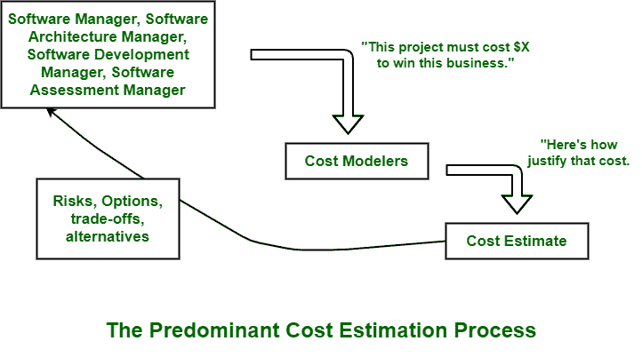

# 软件成本估算

> 原文:[https://www.geeksforgeeks.org/software-cost-estimation/](https://www.geeksforgeeks.org/software-cost-estimation/)

每当我们开发一个软件项目时，我们脑海中出现的主要问题是开发需要花费多少成本，开发需要花费多少时间。在开始开发之前，这些评估是必要的。但是，在软件成本估算过程中出现的主要关键问题是缺乏通常以良好记录的方式创建的项目的案例研究。

软件行业对度量或原子度量单位的定义和解释不一致，从一致性和可比性来看，来自真实和实际项目的数据在很大程度上是高度可疑的。软件成本估算模型和工具的开发人员和供应商之间存在许多争论。

**这些辩论的主要议题如下:**

*   应该使用哪种成本估算模型？
*   是否在源代码行或功能点中测量软件大小。
*   什么是好的估计？

如今，成本估算有几种可用的模型，如 [COCOMO 模型](https://www.geeksforgeeks.org/software-engineering-cocomo-model/)、Checkpoint、ESTIMACS、SLIM、知识计划等。).在所有这些模型中，COCOMO 模型是最开放、最有据可查的成本估算模型之一。目前，现实世界中成本模型的使用大多是自下而上的，而不是自上而下的。

下面给出的图表说明并代表了主要的实践。
软件项目经理定义和描述软件的目标成本，然后直到目标成本能够被证明，它操纵参数和大小。

图表中描述的过程对于分析和预测成本风险以及客观理解敏感性和权衡是非常必要的。它只是迫使软件项目经理检查并找出与实现目标成本相关的风险，并与其他利益相关者讨论和解释这些获得的信息。

以下是**好的软件成本估算**包含的属性:

*   它是简单构想的，即由项目经理、架构团队、开发团队和负责执行工作和任务的测试团队进行规划和支持。
*   所有利益相关者普遍认为它雄心勃勃，但可以实现。
*   它基于一个基于可信基础上的定义明确且高效的软件成本模型。
*   它还基于类似的项目经验数据库，该数据库包括并包含类似的流程、相关的技术、相关的环境、相关的质量要求以及所有类似的人员。
*   它还被详细地定义和解释，以便简单地理解它的所有关键风险，并客观地评估成功的可能性。

从一个好的估计推断，一个理想的估计将来自一个成熟的成本模型，该模型有一个经验基础，通常反映由具有相似成熟过程和工具的同一团队完成的更相似的项目。

**成本估算的使用–**

*   人们需要选择和确定项目需要多少工程师来开发和建立计划阶段的时间表。
*   在监控项目进度时，需要了解项目是否按照程序朝着实现目标的方向发展，是否采取了纠正措施。