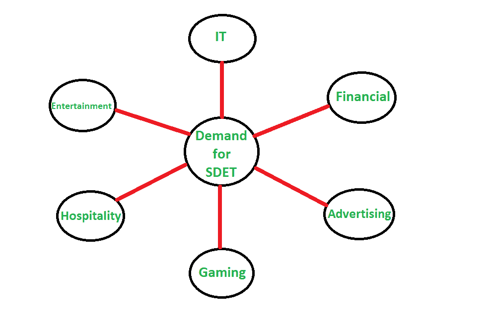

# 测试中的软件开发工程师(SDET)

> 原文:[https://www . geesforgeks . org/software-development-engineer-in-test-sdet/](https://www.geeksforgeeks.org/software-development-engineer-in-test-sdet/)

**测试(SDET)** 中的软件开发工程师是一名开发人员，主要负责软件产品的开发，以及编写测试该产品的框架和工具。意味着它是一个可以在开发和测试角色中有效工作的信息技术专业人员。a(测试中的软件开发工程师)SDET 参与整个软件开发过程，我们主要称之为[软件开发生命周期(SDLC)](https://www.geeksforgeeks.org/software-development-life-cycle-sdlc/) 。软件开发工程师能够理解软件开发和软件测试。

**SDET 的需求:**
如今的组织在业务流程上发生了很大的变化。他们想用更少的人做更多的工作。当涉及到一个人的多才多艺技能时，软件开发工程师在测试(SDET)中的角色就来了。因为他们是唯一参与开发的专业人员，同时他们也能处理开发软件的测试。这就是为什么测试(SDET)的软件开发工程师在开发高性能代码或设计测试框架两方面都有帮助。

公司有雇用多技能信息技术专业人员的趋势。因此，SDET 的软件专业人士非常受欢迎。软件开发工程师在测试(SDET)中的需求主要集中在以下领域:

SDET 的一些基本非技术技能:

*   沟通技巧
*   时间管理和组织技能
*   良好的态度
*   热情
*   协力

一些来自 SDET 的技术技能:

*   设计技巧
*   编程技巧
*   接触 BDD
*   测试方法
*   敏捷+ Devops 曝光

**首选技能:**

*   面向对象的设计和编码技巧
*   熟悉分布式系统、算法和关系数据库。
*   有原料药测试经验。
*   了解各种测试方法
*   理解质量保证方法、生命周期和过程。
*   有数据库测试经验，包括设计和操作测试数据。
*   除了编码经验，还有自动化框架、工具和移动服务的经验。

**SDET 的角色和责任:**

*   与软件开发团队一起开发软件应用程序。
*   执行测试自动化并在多个应用平台上建立框架，如网络、移动和桌面等。
*   创建和管理错误报告，并与团队沟通。
*   构建不同的测试场景和验收测试。
*   与部署团队合作，解决系统的任何级别问题。
*   建立、维护和运行测试自动化框架。