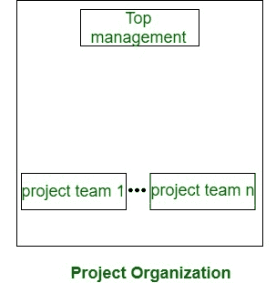
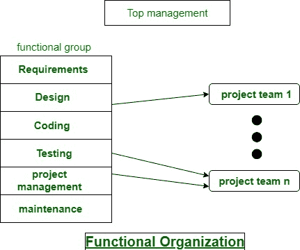

# 软件开发组织结构

> 原文:[https://www . geesforgeks . org/software-development-organization-structure/](https://www.geeksforgeeks.org/software-development-organizational-structure/)

**组织结构:**
通常每个软件包开发组织随时处理很多项目。软件包组织指派完全不同的工程师小组来处理不同的软件项目。每种组织结构都有自己的优点和缺点，问题是“组织作为一个完整的结构是如何构成的？”所以每个软件包项目都要在它的时间点之前完成。

软件包开发组织的结构基本上有两种主要方式:*项目格式和功能格式*。这些解释如下。

1.  **Project format:**
    The project development workers are divided supported the project that they work (as shown below diagram). In the project format, a group of engineers is appointed to the project at the beginning of the project and that they stay with the project until the completion of the project.

    因此，相同的团队执行所有的生命周期活动。显然，功能性的格式比项目格式需要更多的团队间的交流，结果是一个团队应该感知到之前的团队所做的工作。

    

2.  **Functional format:**
    The event workers are divided supported the useful cluster to that they belong. the various project borrows engineers from the specified useful teams for specific parts to be undertaken within the project and come back them to the functional cluster upon the completion of the phase.

    在功能格式中，完全不同的程序员组执行项目的不同阶段。例如，一个团队可能做必需品规格，另一个团队做规划，等等。部分完成的产品从一个团队传递到另一个团队，因为项目在发展。

    因此，由于一个团队的工作成果应该被参与项目的下一个团队清楚地理解，因此有用的格式需要不同团队之间的大量沟通。这需要合理的质量文件，当每个活动。

    