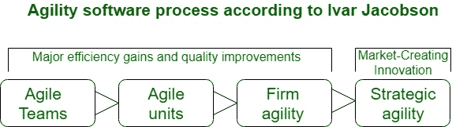

# 软件工程|敏捷性

> 原文:[https://www.geeksforgeeks.org/software-engineering-agility/](https://www.geeksforgeeks.org/software-engineering-agility/)

[敏捷性](https://www.geeksforgeeks.org/software-engineering-agile-software-development/)在描述一种当代软件方法时，已经成为今天的流行语。每个人都很敏捷。一个敏捷团队可以是一个敏捷的团队，能够恰当地应对变化。修改是软件开发极其丰富的内容。

*   正在设计的软件中的变化，
*   团队成员的变化，
*   新技术带来的变化，
*   对他们制造的商品或制造商品的项目有影响的所有类型的变化。

所有的变化都可以表示为下图所示，这是根据软件的 Ivar Jacobson 敏捷性过程考虑的。

对变化的支持应该是我们倾向于扼杀软件的固有的一切，我们倾向于接受的一件事，因为它是软件的核心和灵魂。敏捷团队的同事承认，软件是由团队中的人开发的，这些人的才能、他们的协作能力是项目成功的核心。

在雅各布森看来，修改的一般性在于敏捷性的主要驱动力。如果软件工程师要适应雅各布森描述的快速变化，他们应该迅速行动。但是敏捷超过了对改变的有效反应。

*   它鼓励团队结构和态度，从而使沟通(团队成员之间、技术人员和业务人员之间、软件工程师和他们的经理之间)变得更加容易。
*   它强调运营软件的快速交付，强调中间工作商品的重要性(不是持续的体面的事情)；
*   它将客户作为活动团队的邻近者，并致力于消除继续贯穿几个软件项目的“我们和他们”的角度；
*   它承认在一个不确定的世界里出现有其局限性，一个项目安排应该是多方面的。

敏捷性适用于任何软件方法。然而，为了实现这一点，在设计方法的过程中，必须使项目团队能够适应任务并对其进行轮廓化，以理解敏捷开发方法的流动性的良好方式进行开发，消除最重要的工作产品并保持其精益化，强调渐进的交付策略，尽可能快地将操作包交付给客户，以实现商品分类和操作氛围。