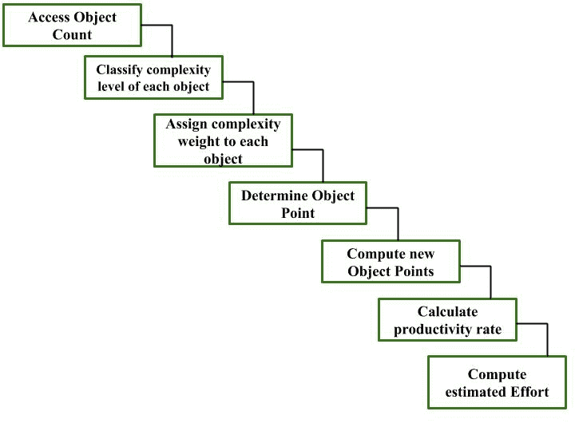
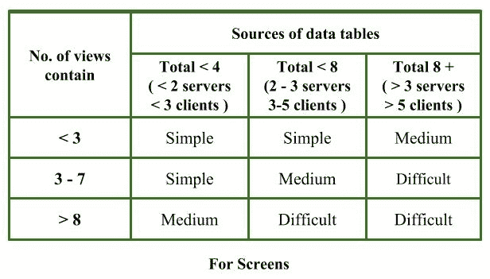
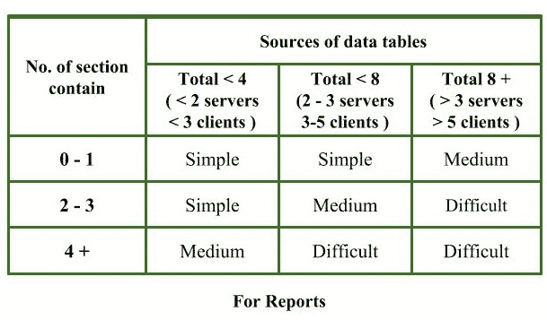
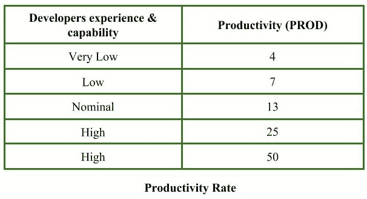

# 软件工程|应用组合评估模型(COCOMO II |阶段 1)

> 原文:[https://www . geesforgeks . org/software-engineering-application-composition-estimation-model-cocomo-ii-stage-1/](https://www.geeksforgeeks.org/software-engineering-application-composition-estimation-model-cocomo-ii-stage-1/)

**应用程序组合估算模型**允许在 [COCOMO II 模型](https://www.geeksforgeeks.org/software-engineering-cocomo-ii-model/)的第一阶段估算成本和工作量。

在该模型中，首先使用*目标点*估计尺寸。目标点易于识别和计数。对象点将屏幕、报告、第三代(3GL)模块定义为对象。

目标点估计是一种新的大小估计技术，但它非常适合于*应用程序合成部分。*

**工作评估:**
采取以下步骤来评估开发项目的工作



**步骤-1:访问对象计数**
估计将构成此应用程序的屏幕、报告和 3GL 组件的数量。

**步骤-2:对每个对象的复杂度等级进行分类**
我们必须根据每个对象实例的特性值，将其分为简单、中等和困难的复杂度等级。
复杂度等级根据给定的表格进行分配





**步骤 3:为每个对象分配复杂度权重**
权重用于三种对象类型，即屏幕、报告和 3GL 组件。
复杂度权重根据对象复杂度等级使用下表进行分配


**第 4 步:确定对象点**
将所有加权的对象实例相加得到一个数，这称为*对象点计数。*

```
Object Point 
= Sigma (number of object instances) 
          * (Complexity weight of each object instance)

```

**第 5 步:计算新的对象点(NOP)**
我们必须估计一个项目中要实现的重用百分比。
取决于重复使用百分比

```
NOP = [(object points) * (100 - %reuse)]/100

```

NOP 是需要开发的对象点，不同于对象点计数，因为项目中可能会重用一些对象实例。

**第 6 步:计算生产率(PROD)**
*生产率*是根据给定的关于开发人员经验和能力的信息计算的。
计算时，我们使用下表



**第 7 步:计算开发一个项目的预计工作量**
*可以计算如下*

```
*Effort = NOP/PROD* 
```

*努力以*人月*来衡量。*

***示例:**
考虑一个数据库应用程序项目*

1.  *该应用程序有四个屏幕，每个屏幕有四个视图，三个服务器和四个客户端有七个数据表。*
2.  *应用程序可以从两个服务器和三个客户端的七个数据表中生成两个各有六个部分的报告。*

*10%的对象点重用。
开发者在类似环境下的经验和能力较低。计算目标点数，新的目标点，并努力开发这样的项目。*

***步骤-1:**
屏幕数量= 4
记录数量= 2*

***步骤-2:**
对于屏幕，
视图数量= 4
数据表数量= 7
服务器数量= 3
客户端数量= 4
通过使用上面给定的信息和表(对于屏幕)，
每个屏幕的复杂度级别=中等*

*对于报告，
节数= 6
数据表数= 7
服务器数= 2
客户端数= 3
通过使用上述给定的信息和表格(对于报告)，
每个报告的复杂程度=困难*

***步骤 3:**
通过使用复杂性权重表，我们可以根据每个对象实例的复杂性级别为其分配复杂性权重。
每个屏幕的复杂性权重= 2
每个报告的复杂性权重= 8*

***第 4 步:***

```
*Object point count 
= sigma (Number of object instances) * (its Complexity weight) 
= 4 * 2 + 2 * 8 = 24* 
```

***第 5 步:***

```
*%reuse of object points = 10% (given)
NOP = [object points * (100 - %reuse)]/100 
= [24 * (100 -10)]/100 = 21.6* 
```

***第 6 步:**
开发人员的经验和能力较低(给定)
使用给定项目的开发人员和生产率信息表
生产率= 7*

***第 7 步:***

```
*Effort 
= NOP/PROD 
= 21.6/7 
= 3.086 person-month* 
```

*因此，开发给定项目的工作量= 3.086 人月。*