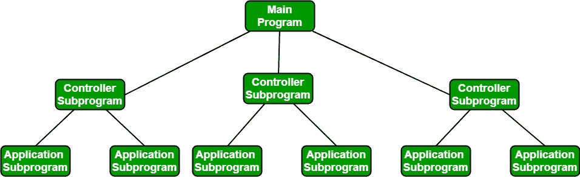

# 软件工程|建筑设计

> 原文:[https://www . geesforgeks . org/software-engineering-architectural-design/](https://www.geeksforgeeks.org/software-engineering-architectural-design/)

**简介:**软件需要架构设计来代表软件的设计。IEEE 将架构设计定义为“定义硬件和软件组件及其接口的集合以建立计算机系统开发框架的过程。”为基于计算机的系统而构建的软件可以展示这些架构风格中的一种。
每种风格描述一个系统类别，包括:

*   执行系统所需功能的一组组件(例如:数据库、计算模块)。
*   这组连接器将有助于组件之间的协调、通信和协作。
*   组件如何集成以形成系统的条件。
*   帮助设计者理解系统整体属性的语义模型。

建筑风格的使用是为系统的所有组件建立一个结构。

**建筑风格分类:**

1.  **以数据为中心的架构:**
    *   数据存储将位于该体系结构的中心，并被更新、添加、删除或修改存储中数据的其他组件频繁访问。
    *   该图展示了一种典型的以数据为中心的样式。客户端软件访问中央存储库。当与客户端相关的数据或客户端感兴趣的数据将通知更改为客户端软件时，这种方法的变体被用来将存储库转换为黑板。
    *   这种以数据为中心的架构将促进可集成性。这意味着现有组件可以被更改，新的客户端组件可以被添加到架构中，而无需其他客户端的许可或关注。
    *   数据可以使用黑板机制在客户端之间传递。
2.  **数据流架构:**
    *   当输入数据要通过一系列计算操作组件转换成输出数据时，使用这种体系结构。
    *   该图表示管道和过滤器架构，因为它同时使用管道和过滤器，并且它有一组称为过滤器的组件，通过管道连接。
    *   管道用于将数据从一个组件传输到下一个组件。
    *   每个过滤器将独立工作，并被设计为接受特定形式的数据输入，并向指定形式的下一个过滤器产生数据输出。过滤器不需要任何相邻过滤器的工作知识。
    *   如果数据流退化为单行转换，那么它被称为批处理序列。该结构接受该批数据，然后应用一系列顺序组件对其进行转换。
3.  **调用和返回架构:**用于创建易于扩展和修改的程序。该类别中存在许多子样式。其中两个解释如下。
    *   **远程过程调用架构:**该组件用于呈现分布在网络上多台计算机之间的主程序或子程序架构。
    *   **主程序或子程序架构:**主程序结构分解成若干子程序或功能成一个控制层次。主程序包含许多可以调用其他组件的子程序。

1.  **面向对象体系结构:**系统的组件封装了数据和操作数据时必须应用的操作。组件之间的协调和通信是通过消息传递来建立的。
2.  **分层架构:**
    *   定义了许多不同的层，每一层执行一组明确定义的操作。每一层都将进行一些操作，这些操作逐渐变得更接近机器指令集。
    *   在外层，组件将接收用户界面操作，在内层，组件将执行操作系统接口(与操作系统的通信和协调)
    *   实用服务和应用软件功能的中间层。