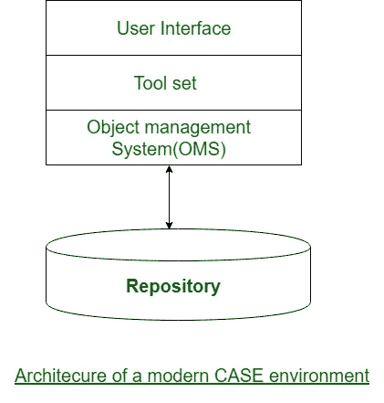

# 软件工程|案例环境的架构

> 原文:[https://www . geesforgeks . org/software-engineering-architecture-of-a-case-environment/](https://www.geeksforgeeks.org/software-engineering-architecture-of-a-case-environment/)

典型潮流 [CASE(计算机辅助软件包工程)](https://www.geeksforgeeks.org/software-engineering-case-tool-and-its-scope/)氛围的设计如下图所示。当代案例氛围的关键要素是计算机程序、工具集、对象管理系统(OMS)和存储库。工具集的特征在前面已经提到过。

**用户界面:**
用户界面提供了访问各种工具的常规框架，因此用户可以更容易地使用不同的工具，并减少学习的开销，无论使用的工具如何。

**对象管理系统(OMS)和存储库:**
不同的案例工具将产品表示为一组实体，如规范、设计、文本数据、项目安排等。事物管理系统将这些逻辑实体映射到底层存储管理系统(存储库)中。

工业在线数据库管理系统正朝着支持庞大的数据量的方向发展，这些数据被构造成简单的相对较短的记录。有一些形式的实体，但数量可观的实例。相比之下，CASE 工具产生了一个超大范围的实体和关系变体，可能每个都有一些实例。因此，事物管理系统负责适当地映射到底层存储管理系统。